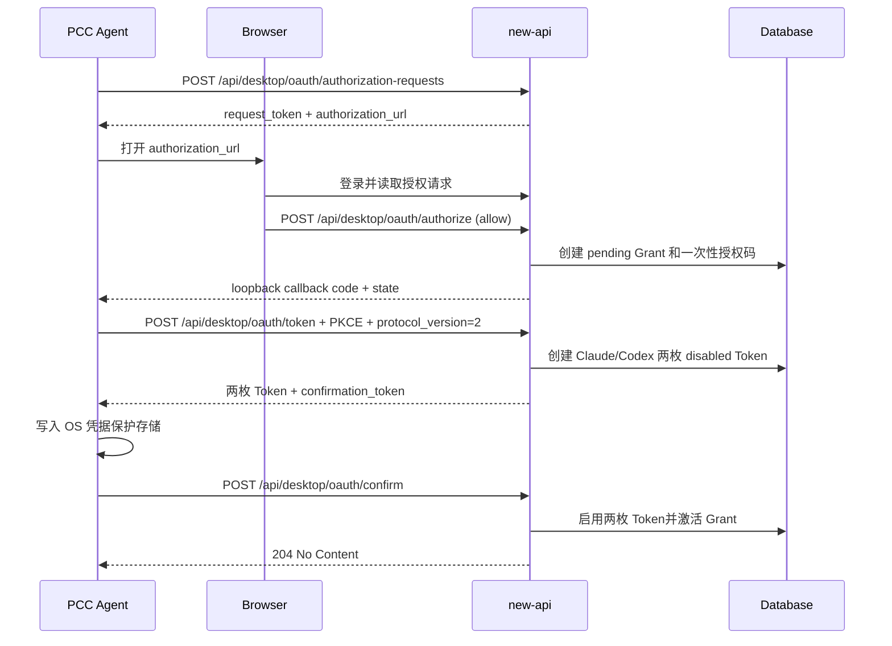

# PCC Agent 授权登录与密钥生命周期

## 1. 文档状态

- 状态：当前实现说明
- 协议版本：Desktop Contract v2
- 更新日期：2026-07-27
- 适用范围：new-api 与 PCC Agent 桌面客户端之间的浏览器授权、双密钥签发、重复授权、撤销和数量限制

本文描述当前代码的实际行为。产品设计背景见
[`pcc-agent-browser-authorization-design.md`](./pcc-agent-browser-authorization-design.md)，通用认证约束见
[`authentication.md`](./authentication.md)。

## 2. 核心结论

1. PCC Agent 是固定公开客户端 `pcc-agent-desktop`，使用 Authorization Code + PKCE S256，不使用 `client_secret`。
2. 每个有效 `DesktopGrant` 固定关联两个 API Token：一个用于 Claude，一个用于 Codex。
3. 密钥按设备授权，而不是按用户全局复用。不同设备各自拥有一组双密钥。
4. 同一设备重复授权不会复用旧密钥，而是生成两枚新随机密钥。
5. Desktop Contract v2 在客户端确认新密钥已经持久化之前保留旧密钥可用；确认成功后原子切换到新密钥。
6. 被替换的旧密钥立即失效，并以软删除方式从正常 Token 查询中移除；旧 Grant 保留撤销原因用于审计。
7. PccAgent 密钥不占用普通用户的 `max_user_tokens` 数量，但受独立的活动设备上限控制。

## 3. 设备与授权的唯一性

同一设备由以下组合识别：

```text
user_id + client_id + device_id_hash
```

- `client_id` 当前固定为 `pcc-agent-desktop`。
- 客户端提交原始安装级 `device_id`。
- 服务端只保存使用 `SESSION_SECRET` 派生密钥计算的 `device_id_hash`，不保存原始设备 ID。
- 修改设备显示名称、平台或应用版本不会把同一 `device_id` 变成新设备。
- 同一用户、客户端和设备最多只有一个 active Grant。

## 4. 数据关系与状态

一个 `DesktopGrant` 最多关联两个 `tokens` 表记录：

| Grant 字段 | 含义 |
| --- | --- |
| `token_id` | Claude Token ID |
| `codex_token_id` | Codex Token ID |
| `status` | 授权状态 |
| `active_slot` | active Grant 使用 `1`，其他状态使用 `NULL` |
| `revoke_reason` | 撤销原因，例如 `reauthorized`、`client_revoked`、`user_revoked` |

Grant 状态流转：

| 状态 | Token 状态 | 含义 |
| --- | --- | --- |
| `pending` | 尚未创建 | 用户已允许，等待客户端使用授权码换取密钥 |
| `awaiting_confirmation` | 两枚均为 disabled | v2 已返回新密钥，等待客户端确认已安全保存 |
| `active` | 两枚均为 enabled | 当前设备可以使用 Claude 和 Codex 密钥 |
| `revoked` | 两枚均不可用 | 用户撤销、客户端撤销、重新授权替换或确认过期 |
| `expired` | 已超过有效期 | 读取时按过期状态处理，Token 鉴权拒绝 |

## 5. 首次授权流程



关键时限：

| 项目 | 有效期 |
| --- | --- |
| 授权请求 | 10 分钟 |
| 一次性授权码 | 2 分钟 |
| v2 确认令牌 | 2 分钟 |
| Claude/Codex Token | 90 天 |

授权请求和授权码均只能原子消费一次。Token 不提供 refresh token；到期后需要重新授权。

## 6. 双密钥签发规则

每次成功换码都会分别生成新的 Claude 和 Codex 随机密钥，两者不会相同，也不会从用户已有普通 Token 或旧桌面授权中复用。

两枚 Token 的共同属性：

- 用户为浏览器中明确同意授权的用户。
- scopes 固定为 `relay account.read usage.read`。
- 有效期相同，当前为 90 天。
- 模型限制始终启用。
- 客户端不能提交用户组、允许模型、额度或有效期来扩大权限。
- Token 子额度可为 unlimited，但用户余额、订阅和现有计费链路仍然生效。

两枚 Token 的差异：

- Claude Token 使用 `desktop_agent_setting.claude_group` 计算分组和模型。
- Codex Token 使用 `desktop_agent_setting.codex_group` 计算分组和模型。
- API 密钥列表通过 `pcc_agent_engine` 标识为 `claude` 或 `codex`。

## 7. 同一设备重复授权

### 7.1 Desktop Contract v2

同一设备重复授权采用“先保存、后切换”：

1. 新授权先创建新的 pending Grant。
2. 换码时生成两枚新密钥，并以 disabled 状态写入数据库。
3. 新 Grant 进入 `awaiting_confirmation`。
4. 旧 active Grant 和旧双密钥继续可用。
5. PCC Agent 把新密钥和确认令牌写入 OS 凭据保护存储。
6. PCC Agent 调用 `/api/desktop/oauth/confirm`。
7. 服务端在事务中重新检查设备上限，撤销同一设备的旧 Grant，启用新双密钥并激活新 Grant。
8. 事务提交后发布新的 Grant 缓存状态，并清理旧 Token 缓存。

切换结果：

| 记录 | 最终状态 |
| --- | --- |
| 旧 Claude/Codex Token | `status=disabled`，设置 `deleted_at`，不可再鉴权 |
| 旧 Grant | `status=revoked`，`revoke_reason=reauthorized` |
| 新 Claude/Codex Token | `status=enabled` |
| 新 Grant | `status=active`，`active_slot=1` |

旧 Token 是软删除而不是物理删除，因此可以保留数据库关联和撤销审计，但不会出现在正常 Token 查询中。

如果确认失败或超过 2 分钟：

- 新双密钥从未启用，不能调用 Relay 或桌面只读接口。
- 旧 active Grant 和旧双密钥保持不变。
- master 节点的鉴权清理任务在启动时及此后每小时扫描过期的未确认 Grant，将其标记为 revoked 并清理相关 Token 缓存。

重复提交已经成功处理过的同一确认令牌是幂等操作，不会再次生成 Token 或重复撤销。

### 7.2 兼容协议 v1

未提交 `protocol_version` 或显式提交 `1` 时使用兼容行为：

- 换码时直接创建并启用新双密钥。
- 同一事务内立即撤销同设备旧 Grant 和旧双密钥。
- 不返回、不需要确认令牌。

当前 PCC Agent 应使用协议 v2，避免客户端尚未持久化新密钥时旧密钥已经失效。

## 8. 不同设备授权

不同 `device_id` 会创建独立 Grant 和独立双密钥，不会撤销其他设备。

`DESKTOP_GRANT_ACTIVE_LIMIT` 控制每个用户的活动设备上限，默认值为 `10`。因此默认最多存在：

```text
10 个 active 设备 × 每设备 2 枚 Token = 20 枚 active PccAgent Token
```

同一设备重新授权不会额外占用活动设备名额。v2 等待确认期间，数据库会短暂同时存在旧的两枚 active Token 和新的两枚 disabled Token，但只有旧 Token 可用；确认后只有新 Token 可用。

## 9. 与普通 Token 数量限制的关系

普通 Token 创建受 `token_setting.max_user_tokens` 控制，默认值为 `1000`。

当前计数语义：

| 计数 | 是否包含 PccAgent Token | 用途 |
| --- | --- | --- |
| `CountUserTokens` | 否 | 判断普通用户 Token 是否达到 `max_user_tokens` |
| `CountAllUserTokens` | 是 | API 密钥列表分页和实际全部 Token 统计 |

因此，普通 Token 已达到上限不会阻止 PCC Agent 授权。PccAgent Token 使用独立的设备上限控制。默认可同时存在最多 1000 枚普通 Token 和 20 枚 active PccAgent Token。

PccAgent Token 仍会显示在用户 API 密钥列表中，但只显示掩码，并标记：

```json
{
  "pcc_agent": true,
  "pcc_agent_engine": "claude"
}
```

## 10. 撤销与失效

### 10.1 客户端主动撤销

PCC Agent 可以使用当前任意一枚桌面 Token 调用：

```text
POST /api/desktop/oauth/revoke
```

服务端根据 Token 找到 Grant，并同时禁用该 Grant 关联的 Claude 和 Codex Token。重复撤销是幂等的。

### 10.2 用户从面板撤销

用户通过浏览器 Session 调用：

```text
DELETE /api/user/desktop-grants/:public_id
```

服务端撤销指定设备 Grant，并同时禁用两枚 Token。

### 10.3 用户状态变化

用户被禁用时，服务端撤销其全部 active 或 awaiting-confirmation 桌面 Grant，并清理关联 Token 缓存。

### 10.4 Token 或 Grant 到期

桌面鉴权要求：

- Token 为 enabled。
- Token 尚未到期。
- Token 仍关联同一用户的 active Grant。
- Grant 尚未到期。
- Grant 包含接口要求的 scope。

任一条件不满足都返回桌面 Token 无效或 scope 不足，不会降级为普通 Token 鉴权。

## 11. 通用 Token 管理限制

PccAgent Token 由设备 Grant 管理，不能通过普通 Token 接口绕过 Grant 生命周期。

普通 Token 管理接口对 PccAgent Token 的规则：

- 列表和搜索：允许，但只返回掩码。
- 查看完整密钥：拒绝。
- 编辑：拒绝。
- 启用或禁用：拒绝。
- 单个或批量删除：拒绝。
- 设备撤销：允许，并同时撤销同一 Grant 的两枚 Token。

完整密钥只在授权码换取 Token 时返回一次。new-api 数据库保存现有 Token 记录所需的密钥值，但控制台不再提供重新读取 PccAgent 完整密钥的接口。

## 12. 缓存与事务保证

以下操作在数据库事务中完成：

- 一次性消费授权码。
- 校验原浏览器 Session 仍然有效。
- 锁定用户的桌面 Grant 操作。
- 创建两枚 Token。
- 激活或暂存新 Grant。
- v2 确认时撤销同设备旧 Grant 并启用新双密钥。

事务提交后再发布 Grant 状态并失效相关 Token 缓存。换码阶段发布失败时，新建 Grant 会被撤销，避免留下客户端无法确认的孤立凭据。确认阶段以数据库状态为准；确认请求可以幂等重试，从而再次发布同一 active Grant 状态。被替换 Token 的 key cache 会单独失效。

## 13. 相关配置

| 配置 | 默认值 | 作用 |
| --- | --- | --- |
| `DESKTOP_GRANT_ACTIVE_LIMIT` | `10` | 每用户 active 桌面设备上限 |
| `desktop_agent_setting.claude_group` | `auto` | Claude Token 分组 |
| `desktop_agent_setting.codex_group` | `auto` | Codex Token 分组 |
| `PCC_DESKTOP_MODEL_ALLOWLIST` | 空 | 与账户可用模型取交集 |
| `token_setting.max_user_tokens` | `1000` | 普通 Token 上限，不包含 PccAgent Token |

## 14. 关键实现与回归测试

主要实现：

- `service/desktop_authorization.go`
- `service/desktop_contract.go`
- `model/desktop_grant.go`
- `model/token.go`
- `controller/desktop_oauth.go`
- `controller/token.go`

主要回归测试：

- `service/desktop_authorization_test.go`
- `controller/desktop_oauth_test.go`
- `model/desktop_grant_crossdb_test.go`
- `model/desktop_grant_cache_test.go`

测试覆盖首次签发、Claude/Codex 密钥分离、v2 确认、同设备重复授权、旧密钥失效、设备上限复查、双密钥同时撤销、普通 Token 数量隔离、只读管理约束、缓存失效以及 SQLite/MySQL/PostgreSQL 的 Grant 替换行为。
