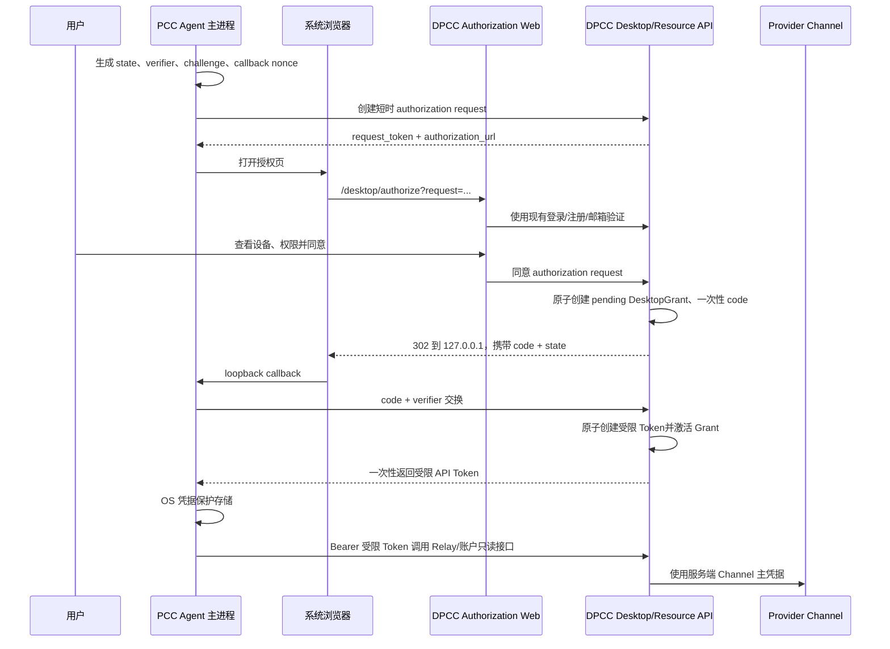

# PCC Agent 浏览器授权接入 New API：实施设计

> 状态：已实施并完成本机联动验证
> 适用仓库：New API 与 Harness/PCC Agent
> 设计目标：桌面端不再要求普通用户手工填写多组 API Key、Secret 和 User ID，而是通过用户控制的 New API / DPCC API 网页完成登录、注册、邮箱验证和设备授权。
> 变更约束：本方案已经获得实施批准；后续变更仍需遵守 New API 分支策略。

## 1. 执行摘要

采用“公开桌面客户端 + 浏览器授权码 + PKCE”的方式：

1. PCC Agent 在本机生成 `state`、PKCE `code_verifier`/`code_challenge`，在 `127.0.0.1` 随机端口启动一次性回调监听。
2. Agent 向 New API 创建一个 10 分钟有效的授权请求，然后用系统浏览器打开 New API 授权页。
3. 用户使用 New API 现有登录能力登录；新用户使用现有注册和邮箱验证能力创建账号，再自动返回授权页。
4. 用户明确同意后，New API 创建该设备的 pending `DesktopGrant` 和一次性授权码，但暂不创建 API Token。
5. 浏览器把 2 分钟有效、只能使用一次的授权码送回本机回调。Agent 使用 PKCE 换码成功时，New API 才原子创建 Claude、Codex 两个受模型、用途、用户和有效期约束的普通用户 API Token，并激活 Grant。
6. 两个 Token 只返回一次，只保存在 Electron 主进程控制的 OS 凭据保护存储中。渲染进程、`settings.json`、URL、日志和浏览器均不得获得 Token。
7. 平台 Channel/Provider 主密钥始终只存在于 New API 服务端；桌面端获得的不是后台 PAT、浏览器会话、管理员凭据或支付凭据。

第一阶段只支持 loopback redirect。自定义 URI Scheme 作为后续兼容能力，不作为首发主路径。首发不引入 OAuth refresh token；受限 Token 默认 90 天有效，客户端在到期前引导重新授权。这样可以显著减少 New API 的协议面和高价值长期凭据。

## 2. 设计决策

| 项目 | 决策 |
| --- | --- |
| 客户端类型 | 固定注册的公开客户端 `pcc-agent-desktop`，无 `client_secret` |
| 浏览器授权页 | 固定为 `https://api.dpccgaming.xyz`；只用于浏览器登录、注册和授权同意 |
| Desktop API / Resource Server | PccAgent 的授权请求、换码、撤销、模型、账户和用量请求固定为 `https://origin-api.dpccgaming.xyz` |
| 授权方式 | Authorization Code + PKCE，强制 `S256` |
| 首发回调 | `http://127.0.0.1:{ephemeral-port}/oauth/callback/{nonce}` |
| 自定义 Scheme | 第二阶段可选；不得替代首发 loopback |
| 授权请求有效期 | 10 分钟、一次性 |
| 授权码有效期 | 2 分钟、一次性 |
| 桌面 Token 有效期 | 90 天；到期前 7 天提示重新授权 |
| Token 数量 | 每设备两个 Token：Claude 与 Codex 各一个，分别使用管理员配置的分组 |
| Token 权限 | 只允许服务端计算出的模型集合与只读账户接口；不允许会话管理、Token 管理、管理后台或支付写操作 |
| 桌面账号凭据 | Electron 主进程 + OS-backed `safeStorage` 严格模式 |
| 用户创建 | 仅由 New API 现有注册/邮箱验证流程完成；不创建匿名或影子用户 |
| Token 创建时点 | 已登录用户同意后，且授权码 + PKCE 交换成功时创建 |
| 支付入账 | 仅由现有服务端支付回调完成；授权和桌面回调永不入账 |
| Guest 模式 | 明确、可持久化、可随时升级登录；没有 Token 时不得尝试 DPCC 上游 |

## 3. 当前状态调查

### 3.1 New API 已有能力

New API 已具备大部分身份、配额和 Relay 基础能力：

- `controller/user.go` 和 `router/api-router.go` 已提供注册、登录、邮箱验证码、密码重置、OAuth 登录、2FA、Passkey、刷新和退出。
- `service/auth_token.go` 使用 15 分钟 Dashboard JWT；浏览器刷新凭据是 HttpOnly、SameSite Cookie。
- `model/user_session.go` 提供可枚举、可撤销的服务端浏览器会话。
- `model/auth_flow.go` 已有 HMAC 摘要存储、短时、一次性、原子消费的 `AuthFlow`，当前用于 OAuth state、2FA、Passkey 和 Telegram 等流程。
- `model/token.go` 已有用户 API Token，支持状态、到期时间、Token 额度、用户额度、模型限制、IP 限制、用户组和软删除。
- `middleware/token_auth.go` 已在 Relay 请求中检查用户状态、Token 状态、到期、额度、可用组、模型和 IP 限制。
- `model/user.go` 已有用户角色、状态、邮箱、用户组、余额配额、已用配额和 `auth_version`。
- `model/subscription.go`、`model/topup.go` 及各支付控制器已有订单、订阅、服务端回调、事务和幂等处理基础。
- `docs/authentication.md` 明确区分浏览器会话、PAT 和 API Token。PAT 不是浏览器会话，不应被桌面授权流程复用。

注册当前行为需要特别注意：

- 开启邮箱验证时，现有注册接口会验证邮箱验证码后创建普通用户。
- 注册成功后不会自动创建浏览器登录态，前端会返回登录页。
- `GENERATE_DEFAULT_TOKEN` 默认是 `false`；若运营部署显式打开，注册会创建一个无限期、未限制模型的默认 Token。桌面授权不得读取、返回或复用该 Token。面向消费者的部署应保持该选项关闭，或单独审计其必要性。
- `QuotaForNewUser` 可能在注册时赠送用户额度。这是现有注册业务规则，不应由桌面授权请求、同意、授权码交换或本机回调重复触发。

这里需要明确“用户创建”和“桌面授权”的顺序语义：新用户必须先通过现有邮箱验证注册创建 `User`，之后才能建立浏览器 session 并作出可归属的同意。因此“仅在认证同意后 provision”适用于 DesktopGrant 和桌面 Token，而不是已验证的基础用户记录。为满足该目标不应引入 pre-user、影子用户或在换码时第二次创建用户。

### 3.2 New API 缺失能力

New API 当前不是供桌面公开客户端使用的 OAuth Authorization Server，缺少：

- 固定桌面客户端和严格 redirect 校验。
- PKCE 授权请求、用户设备同意页、授权码交换。
- “用户、设备、同意、受限 API Token”之间的可审计关联。
- 桌面客户端专用的最小账户、额度、订阅和用量只读接口。
- 用户在网页中查看并撤销已授权桌面设备的能力。
- 注册页在“登录 -> 注册 -> 登录 -> 原授权页”链路中完整保留 `redirect` 的能力。

现有通用 `/api/token` CRUD 不适合作为桌面交换接口：

- 创建 Token 的接口不会以一次性授权码语义返回密钥。
- `/api/token/:id/key` 可在普通用户后台再次显示完整密钥，权限面大于桌面授权需要。
- 通用 Token 创建允许用户选择的字段比桌面客户端应获得的字段更多。
- `UserAuth` 可接受 Dashboard JWT 或 PAT；设备同意必须额外要求真实浏览器会话身份，不能允许 PAT 代表用户点击同意。

### 3.3 Harness/PCC Agent 当前状态

当前首次欢迎流程位于：

- `src/components/welcome/WelcomeWizard.tsx`
- `src/components/welcome/WelcomeStep.tsx`
- `src/components/welcome/AccountStep.tsx`

现有 Account 步骤要求用户填写：

- Gateway URL
- Claude API Token
- Codex API Token
- User ID
- System Access Token

这正是本设计要整体替换的“两组 API Key、两组 Secret 和 User ID”式体验；实际当前组件包含 Gateway URL、Claude Token、Codex Token、User ID 和 System Access Token 五个输入。当前完成状态仅由 renderer 的 `pcc-agent-welcome-completed` localStorage 标记；跳过整个 Wizard 与“明确选择 Guest”没有语义区分。

现有凭据和配置路径存在以下边界问题：

- `electron/src/lib/app-settings.ts` 把 `dpccUpstream.claudeToken`、`dpccUpstream.codexToken`、账户 Access Token、User ID 及自定义网关 Secret 保存在 `{userData}/pcc-agent-data/settings.json`。
- 设置对象会通过 IPC 到达渲染进程，因此当前 DPCC 凭据不满足“主进程和 OS 凭据保护存储独占”的目标。
- `electron/src/lib/json-file-store.ts` 已支持 Electron `safeStorage`，MCP/Jira OAuth Store 已使用它；但不可用时可以回退明文。账户 Token 不得沿用该明文回退。
- `electron/src/lib/mcp-oauth-flow.ts` 已有随机 loopback 端口和 `shell.openExternal` 模式，可复用流程经验，但不能直接复制其安全边界：新流程必须固定监听 `127.0.0.1`、使用随机回调路径、校验 `state`、强制 PKCE、限制路径，并在超时后关闭监听。
- `electron/src/lib/upstream-resolver.ts` 当前从设置读取 Claude/Codex Token。默认 DPCC 模式在无 Token 时仍可能进入不可用状态。
- `src/components/settings/AccountSettings.tsx` 当前仍依赖旧 Token/PAT/User ID 读取账户和日志。
- 完整 Welcome 重放目前只在开发版 Advanced 设置中出现；生产版 Settings 必须增加可重新进入“账户登录/授权”的入口。
- Electron 已有 single-instance lock，但当前没有完整的自定义 URI Scheme 注册、macOS `open-url`、Windows/Linux second-instance URL 分发。

## 4. 目标架构



信任边界：

- 浏览器负责用户身份验证和明确同意，但不获得桌面 API Token。
- Renderer 只显示状态，不读取授权码、PKCE verifier 或 API Token。
- Electron 主进程拥有 loopback listener、PKCE verifier 和 OS 凭据存储。
- New API 是用户、额度、订阅、授权和 Token 的唯一服务端事实来源。
- Provider 主凭据只存在于 New API Channel 配置和服务端执行环境。
- Agent 只向已固定或由用户在 Advanced 中明确确认的 Desktop API origin 发送授权请求、换码、撤销和 Token；不得根据网页回调、深链参数或服务端响应切换 issuer。
- DPCC 消费者构建固定信任浏览器授权 origin `https://api.dpccgaming.xyz` 与 Desktop API/resource origin `https://origin-api.dpccgaming.xyz` 这一对地址。浏览器地址不得接收桌面 Token、code verifier 或模型请求。

## 5. 用户体验与完整流程

### 5.1 首次欢迎页

授权/登录入口必须成为 Welcome Wizard 第一页，替换当前账号字段表单：

- 主标题：登录 DPCC API
- 主操作：`使用浏览器登录`
- 登录状态：等待浏览器、已授权、失败、已取消、已过期
- 登录成功后显示脱敏账号、授权设备名和额度摘要，然后继续后续外观、权限、项目等引导
- 页面右下角提供清晰但视觉次要的 `Continue without signing in`
- 不再向普通用户显示 Claude Token、Codex Token、System Access Token 或 User ID 输入框

点击 `Continue without signing in` 是明确的 Guest 选择，不等同于按 Escape、关闭窗口或跳过整个引导。Guest 选择需要持久化为非敏感状态，并继续后续本地设置步骤。

### 5.2 已有用户

1. Agent 创建授权请求并打开浏览器。
2. New API 未登录时复用现有 `/sign-in`。
3. 登录成功返回同源 `/desktop/authorize?request=...`。
4. 同意页显示应用名、设备名、平台、请求权限、Token 有效期、允许模型范围概述和撤销入口说明。
5. 用户点击“允许”后回到 Agent；点击“拒绝”后返回 `error=access_denied`，Agent 保持未登录。

### 5.3 新用户

1. 授权页触发登录页。
2. 登录页的“注册”链接携带经过同源校验的 `redirect`。
3. `/sign-up` 和现有注册/邮箱验证流程保留该 `redirect`。
4. 注册完成后进入登录页；登录成功回到原授权页。
5. 用户点击“允许”后创建 pending DesktopGrant；只有随后授权码交换通过 PKCE 校验，才创建受限 Token 并激活 Grant。

不得在“创建授权请求”“发送邮箱验证码”“注册完成”或“登录成功”时提前创建桌面 Token。

### 5.4 设置页重新进入

生产版 `Settings > Account` 必须提供：

- 未登录/Guest：`登录 DPCC API`
- 已登录：账户摘要、设备名、Token 到期时间、`重新授权`
- 已登录：`退出并撤销此设备`
- 凭据异常：`修复登录`
- 可选链接：在浏览器打开 New API 的设备授权管理页、余额/订阅页

该入口只重开账户授权界面，不强制重放完整 Welcome Wizard。现有开发版 Advanced Welcome 重放可以保留，但不再承担生产账户入口职责。

### 5.5 Guest 模式

Guest 可用：

- 本地项目、工作区、文件、Git、终端、历史和不依赖 DPCC 的界面能力。
- 已在本机独立登录的 Claude/Codex CLI，前提是 resolver 检测到本地凭据并选择本地来源。
- 用户自行配置和自行负责认证的第三方 ACP Agent 或自定义网关。

Guest 不可用：

- DPCC 托管的 Claude/Codex 上游。
- DPCC 模型目录、余额、用量、订阅、账户同步和充值快捷入口。
- 未来明确标注为账号专属的云能力。

进入 Guest 时：

- 若检测到本地 CLI 认证，自动建议或选择对应的 local source。
- 若没有本地认证，DPCC engine 必须显示禁用状态和登录入口，不能使用空 Token 启动。
- 依赖 DPCC 的标题生成、提交信息生成等一次性辅助调用必须禁用或使用已有本地 fallback。
- 后续在 Settings 登录后，立即刷新 resolver 和账户状态，不要求清除本地项目或重做整个 onboarding。

消费者发行版不应在首次登录页继续展示 Gateway URL。正式 DPCC 构建固定使用浏览器授权 origin `https://api.dpccgaming.xyz` 和 Desktop API/resource origin `https://origin-api.dpccgaming.xyz`，两者不得由授权响应或网页参数动态替换。需要连接自托管 New API 的高级用户必须显式确认完整的 HTTPS 浏览器授权/API 地址组合；凭据按 API issuer + client ID + device ID 隔离，不能把一个服务端签发的 Token 发送到未确认的 API 服务。开发环境可单独允许 loopback HTTP 地址，生产构建不得接受普通远程 HTTP。

## 6. 协议与端点

所有响应包含 `Cache-Control: no-store`。错误使用稳定机器码，用户文案由前端 i18n 处理。PccAgent 向 `https://origin-api.dpccgaming.xyz` 调用创建授权请求、换码、撤销、模型 Relay、`/v1/models`、`/api/desktop/account` 和 `/api/desktop/usage`。返回的浏览器 `authorization_url` 使用 `https://api.dpccgaming.xyz`；正式部署必须设置 `DESKTOP_AUTHORIZATION_ORIGIN=https://api.dpccgaming.xyz`。未配置时仅为同源和自托管兼容而沿用 `ServerAddress`。两个 origin 必须连接同一套用户、Grant、Token、额度和日志事实来源。

### 6.1 创建授权请求

`POST /api/desktop/oauth/authorization-requests`

无需登录，但必须使用专用限流。

```json
{
  "client_id": "pcc-agent-desktop",
  "redirect_uri": "http://127.0.0.1:49152/oauth/callback/4Mv...",
  "state": "base64url-32-bytes",
  "code_challenge": "base64url-sha256",
  "code_challenge_method": "S256",
  "device_id": "installation-uuid",
  "device_name": "Alice's MacBook Pro",
  "platform": "darwin-arm64",
  "app_version": "x.y.z"
}
```

返回：

```json
{
  "request_token": "opaque-one-time-reference",
  "authorization_url": "https://api.dpccgaming.xyz/desktop/authorize?request=...",
  "expires_in": 600
}
```

服务端校验：

- `client_id` 必须是固定注册值。
- 只允许 `http` + 主机字面值 `127.0.0.1`；不得接受 `localhost`、局域网地址、通配域名、userinfo、fragment 或重定向链。
- 端口必须是有效非特权端口，路径必须匹配 `/oauth/callback/{高熵 nonce}`。
- `state` 至少 32 随机字节；设备名、平台和版本只作为有长度限制的显示元数据。
- `code_challenge_method` 只能为 `S256`。
- 保存并在后续步骤精确匹配完整 `redirect_uri`，不能重新解释或宽松归一化。

### 6.2 查询授权请求

`GET /api/desktop/oauth/authorization-requests/:request_token`

要求 Dashboard `UserAuth`，并额外通过与现有 session 管理相同的 browser-session 身份检查。返回客户端显示名、设备显示信息、权限、到期时间；不返回 challenge、state 或内部用户标识。

### 6.3 同意或拒绝

`POST /api/desktop/oauth/authorize`

要求真实浏览器 session，拒绝 PAT 代表用户操作。请求：

```json
{
  "request_token": "opaque-one-time-reference",
  "decision": "allow"
}
```

`allow` 时在同一数据库事务中：

1. 原子消费授权请求。
2. 创建同一用户、客户端、设备的 pending `DesktopGrant`，不影响当前 active Grant。
3. 创建 2 分钟有效的 `desktop_authorization_code` AuthFlow。

返回同意页应导航到的精确 loopback URI：

```json
{
  "redirect_uri": "http://127.0.0.1:49152/oauth/callback/4Mv...?code=...&state=..."
}
```

拒绝返回同一 redirect，使用 `error=access_denied&state=...`，且不创建 Grant 或 Token。请求过期使用 `error=request_expired`。

### 6.4 授权码交换

`POST /api/desktop/oauth/token`

```json
{
  "grant_type": "authorization_code",
  "client_id": "pcc-agent-desktop",
  "code": "opaque-one-time-code",
  "redirect_uri": "http://127.0.0.1:49152/oauth/callback/4Mv...",
  "code_verifier": "43-to-128-character-verifier",
  "device_id": "installation-uuid"
}
```

交换必须精确验证 client、redirect、设备哈希和 PKCE，并在同一事务中：

1. 原子消费授权码。
2. 锁定同一用户、客户端、设备的已有 active Grant。
3. 创建服务端策略决定的 Claude、Codex 两个受限 API Token。
4. 撤销旧 active Grant 的全部 Token，激活新的 pending Grant。

任何一步失败都回滚，旧 active Grant 继续可用。成功后只返回一次：

```json
{
  "token_type": "Bearer",
  "tokens": {
    "claude": {
      "access_token": "restricted-claude-token",
      "group": "claude-group",
      "allowed_models": ["claude-sonnet-4-5"]
    },
    "codex": {
      "access_token": "restricted-codex-token",
      "group": "codex-group",
      "allowed_models": ["gpt-5.3-codex"]
    }
  },
  "expires_in": 7776000,
  "scope": "relay account.read usage.read",
  "account": {
    "display_name": "Alice",
    "quota": 123456,
    "subscription_state": "active"
  }
}
```

不得返回：

- Dashboard JWT 或 refresh cookie。
- 用户 PAT/System Access Token。
- 管理员 Token。
- Channel/Provider 主密钥。
- 支付签名密钥。
- 可再次读取桌面 Token 的通用 Token ID/key URL。

### 6.5 账户和用量

`GET /api/desktop/account`

- 使用受限 Token 认证。
- 返回脱敏用户资料、用户状态、可用额度、订阅/权益摘要、允许模型和 Token 到期时间。
- 不返回邮箱验证码状态以外的敏感认证信息、角色管理信息或其他设备秘密。

`GET /api/desktop/usage`

- 使用 `usage.read`。
- 返回服务端聚合、分页的当前用户用量；不复用需要 PAT 的完整 Dashboard 日志接口。

这两个接口应通过 Token 对应的 active `DesktopGrant` 再做一次 scope/status 检查，不能仅凭通用 `TokenAuth` 放行。

### 6.6 撤销和设备管理

`POST /api/desktop/oauth/revoke`

- 接受当前受限 Token，幂等撤销对应 Grant 和 API Token。
- 即使 Token 已到期，也允许通过安全摘要定位并撤销；响应不得暴露 Token 是否存在。

现有用户后台新增：

- `GET /api/user/desktop-grants`
- `DELETE /api/user/desktop-grants/:public_id`

用户可查看设备名、创建时间、最近使用、到期时间和状态，并撤销单个设备。用户改密、禁用、删除或全局注销策略触发时，应按产品策略撤销全部 DesktopGrant；首发建议用户禁用/硬删除必撤销，普通浏览器 logout 只退出当前浏览器，不自动注销桌面设备。

## 7. 数据模型与角色

### 7.1 复用 AuthFlow

在 `model/auth_flow.go` 增加两个 purpose：

- `desktop_authorization_request`
- `desktop_authorization_code`

复用现有随机 opaque token、HMAC 摘要、TTL、一次性原子消费和 payload。新增一个支持传入 GORM transaction 的创建方法，使“同意、pending Grant、code”和后续“消费 code、创建两个 Token、激活 Grant”分别原子提交。payload 使用 `common.Marshal`/`common.Unmarshal`，不直接调用 `encoding/json`。

授权请求 payload：

- `client_id`
- 精确 `redirect_uri`
- `state`
- `code_challenge`
- `device_id_hash`
- 有长度限制的显示元数据

授权码 payload：

- `client_id`
- 精确 `redirect_uri`
- `code_challenge`
- `user_id`
- `session_id`
- `grant_public_id`
- `device_id_hash`

数据库只保存 flow token/code 的 HMAC 摘要，不保存原值。

### 7.2 新增 DesktopGrant

建议只新增一张表：

| 字段 | 说明 |
| --- | --- |
| `id` | GORM 主键 |
| `public_id` | 对外随机 UUID/opaque ID，唯一 |
| `user_id` | New API 用户 |
| `client_id` | 固定桌面客户端 |
| `device_id_hash` | 使用服务端 Secret HMAC 的安装 ID |
| `device_name` | 有长度限制的用户可见名称 |
| `platform` / `app_version` | 审计元数据 |
| `token_id` | 激活后关联的 Claude API Token；兼容旧版单 Token Grant，可空且唯一 |
| `codex_token_id` | 激活后关联的 Codex API Token，可空且唯一 |
| `scopes` | 服务端定义的稳定 scope 集合 |
| `status` | `pending`、`active`、`revoked`、`expired` |
| `active_slot` | active 时为 `1`，其他状态为 `NULL` |
| `created_time` | 授权时间 |
| `last_used_time` | 限频更新的最近使用 |
| `expired_time` | 与 Token 一致 |
| `revoked_time` / `revoke_reason` | 审计 |

使用 `(user_id, client_id, device_id_hash, active_slot)` 唯一索引保证同一设备最多一个 active Grant。SQLite、MySQL 5.7.8 和 PostgreSQL 9.6 都允许 unique index 中存在多行 `NULL`，因此 pending/revoked 行的 `active_slot=NULL`，只有 active 行写 `1`。交换时仍使用 `lockForUpdate(tx)` 锁定旧 active Grant，先撤销其 Claude/Codex Token，再激活新 Grant。过期未交换的 pending Grant 可由定时清理软删除，它从未持有 Token。

`DesktopGrant` 必须加入用户硬删除的认证数据清理。撤销事务提交后清除关联 Token 的 Redis cache。不得保存原始 Token、PKCE verifier 或原始 device ID。

### 7.3 受限 API Token 策略

每个成功换码并激活的 Grant 创建两个现有 `model.Token`，分别供 Claude 与 Codex 使用：

- `UserId`：同意用户。
- `Name`：稳定引擎前缀加脱敏设备名，例如 `PCC Agent Claude - Alice MacBook` 和 `PCC Agent Codex - Alice MacBook`。
- `Status`：enabled。
- `ExpiredTime`：90 天。
- `Group`：管理员分别通过 `desktop_agent_setting.claude_group`、`desktop_agent_setting.codex_group` 配置；默认使用现有可用 `auto` 策略，不能由客户端提交。
- `ModelLimitsEnabled`：`true`。
- `ModelLimits`：服务端根据用户组、权益和 PCC Agent 支持矩阵计算。
- `UnlimitedQuota`：可为 `true`，其含义仅是“不增加额外 Token 子额度”，用户余额/订阅仍由现有计费路径强制执行；若运营需要设备预算，则由服务端设置有限 Token 额度。
- `AllowIps`：loopback 授权不能可靠固定用户公网 IP，首发不设置。

这两个新增配置只决定浏览器授权产生的两个 Token 的 `Group`，所选分组必须已经对授权用户可用，否则服务端拒绝签发。它们不会修改已有 Token、`GroupRatio`、`GroupGroupRatio`、`UserUsableGroups`、用户所属分组或计费倍率；Token 后续仍经过现有分组权限、模型限制和计费链路。

用户自己的 API 密钥页面继续使用现有 Token 明细展示这两个 Key，包括掩码、按需查看/复制、状态、分组、模型限制、累计用量、创建时间、最后使用时间和过期时间。列表响应额外返回 `pcc_agent: true` 与 `pcc_agent_engine: "claude" | "codex"`，前端明确标记为“PccAgent 专用”。这些 Key 在通用 Token 管理中只读：不得编辑、启停或删除，也不得进入批量删除；设备撤销继续作为唯一失效入口，并同时撤销同一 Grant 的两个 Key。

### 7.4 权限角色

| 主体 | 能力 |
| --- | --- |
| 未登录浏览器 | 创建授权请求、登录、注册、邮箱验证 |
| 已登录浏览器 session | 查看授权请求、同意、拒绝、管理自己的设备 |
| 用户 PAT | 不得同意设备授权，不得换取桌面 Token |
| DesktopGrant Token | 受限 Relay、`account.read`、`usage.read` |
| 普通用户 API Token | 保持现有行为，不自动获得桌面设备管理能力 |
| 管理员 | 现有用户/Token 管理；可查看 Grant 元数据，不查看秘密 |
| Channel/Provider credential | 只在服务端使用，永不下发 |

## 8. 安全要求

### 8.1 浏览器授权

- PKCE verifier 为 43-128 字符高熵 base64url；challenge 为 `BASE64URL(SHA256(verifier))`。
- 只允许 `S256`，拒绝 `plain`。
- `state` 至少 32 随机字节，Agent 必须常量时间比较精确值。
- request 10 分钟、code 2 分钟；两者只能成功消费一次。
- code 必须绑定 user、browser session、client、完整 redirect、challenge、device hash 和 Grant。
- 同意页设置 `Content-Security-Policy`、`frame-ancestors 'none'`、`X-Frame-Options: DENY`、`Referrer-Policy: no-referrer`。
- 同意页不加载第三方脚本、像素或会收到 query 的跨域资源。
- 登录/注册 `redirect` 只接受同源相对 URL，不允许把登录流程变成开放重定向。
- 对授权请求、同意、交换和重试分别按 IP、用户、client、device 限流；限制每用户活动设备数。
- 系统浏览器只能打开固定的 `https://api.dpccgaming.xyz/desktop/authorize`；该 origin 不接收 PccAgent 的 code verifier、桌面 Token 或模型请求。
- Agent 的 authorization request、token exchange、revoke、模型、账户只读和用量请求必须固定使用 `https://origin-api.dpccgaming.xyz`；禁止跟随跨 origin redirect 后提交 code/verifier/Token。

### 8.2 Loopback redirect

- Listener 在打开浏览器前成功绑定 `127.0.0.1:0`。
- 只接受生成的随机路径和一次 GET；其他路径返回 404。
- 校验 Host/端口、query 中的 `state`，拒绝缺少 code/error 的请求。
- 返回简短本地成功页后立即关闭；总超时建议 180 秒。
- 不使用 `localhost`，避免 DNS、IPv4/IPv6 和代理差异。
- 系统浏览器无法打开或回调超时时，用户可重试；每次重试生成全新 request、state、verifier、nonce 和端口。

第二阶段若增加 `pccagent://oauth/callback`：

- 在 Electron builder 注册 protocol。
- macOS 处理 `open-url`，Windows/Linux 处理 second-instance argv。
- URL 分发必须进入主进程同一个 state/PKCE 校验器。
- 自定义 Scheme 存在被其他应用抢注风险，因此仍优先 loopback。

### 8.3 桌面 Token 存储

- 新增专用严格凭据 Store，或为 `JsonFileStore` 增加禁止明文 fallback 的严格模式。
- macOS 使用 Keychain-backed `safeStorage`，Windows 使用 DPAPI，Linux 使用 Secret Service/KWallet 等 Electron 可用 backend。
- Linux 检查 `safeStorage.getSelectedStorageBackend()`；`basic_text`、不可用或解密失败时，不写入 Token，不声称登录成功，提示用户修复系统凭据库。
- renderer、localStorage、Zustand 状态、`AppSettings`、IPC 返回值和遥测不得包含 Token。
- 每条凭据记录绑定规范化 Desktop API issuer、client ID 和 device ID；浏览器授权 origin 由受信发行配置单独固定。任一 origin 改变时都视为另一账号连接，绝不自动复用 Token。
- preload 只暴露 `beginAuthorization`、`cancelAuthorization`、`getAccountStatus`、`logoutAndRevoke`、`reauthorize`。
- 主进程在启动 Claude/Codex 子进程时按需读取 Token 并注入环境，renderer 只获得 masked 状态。
- 日志必须统一 redact `Authorization`、code、verifier、request token、API Token 和 loopback query。
- Token 的 OS 保护不能防御已控制同一用户会话的恶意进程，因此仍需要短有效期、模型限制、服务端撤销和用户额度保护。

### 8.4 服务端 Token 与计费安全

- 客户端不得提交 `user_id`、额度、用户组、模型 allowlist、价格、折扣或 Token 有效期。
- 服务端从 browser session 获取用户，从服务端配置和现有权益计算策略。
- Token 只能扣当前用户的现有余额/订阅，不能跨用户或跨组提升权限。
- 禁用用户、撤销 Grant、Token 到期或模型不允许时，Relay 必须 fail closed。
- 不修改现有 quota math、pre-consume、settlement、Channel 选择和 Provider credential 路径。

## 9. 支付回调与信用入账边界

浏览器授权不是支付流程。以下事件绝不能增加额度或权益：

- 创建授权请求。
- 登录、注册返回、邮箱验证返回。
- 用户点击同意。
- loopback callback。
- authorization code exchange。
- Agent 报告“支付成功”或“浏览器已返回”。

充值和订阅只能继续通过现有 New API 服务端流程：

1. 已登录用户在 New API Web 创建 pending 订单。
2. 服务端生成 provider checkout。
3. Provider 直接调用现有服务端 webhook/callback。
4. 服务端验证签名、provider/method、订单号、用户映射、金额和币种。
5. 在事务和行锁中把 pending 订单变为已完成；重复 callback 幂等返回，不重复入账。
6. 入账后刷新用户/订阅缓存并写审计日志。
7. Agent 只通过 `GET /api/desktop/account` 轮询或用户手动刷新观察新状态。

不得新增“桌面传入金额”“桌面传入 user_id”“callback URL 指向本机”“根据浏览器 return URL 入账”等路径。所有 quota conversion 必须继续使用 `common/quota_math.go` 的 checked helper 和现有饱和审计；本功能不新增任何 credit 算术。

## 10. New API 实施路径

按最小、隔离、可移除的 feature slice 实施：

1. **模型层**
   - 新增 `model/desktop_grant.go`。
   - 在 `model/main.go` 使用 GORM AutoMigrate 纳入模型，验证三数据库。
   - 在 `model/auth_flow.go` 增加两个 purpose 和 transaction-aware create。
   - 在用户硬删除认证数据清理中加入 DesktopGrant。
   - Grant 模型内部完成“换码时创建两枚新 Token、撤销旧 Grant 的全部 Token、激活新 Grant”的事务，复用 `model.Token`，不要重构通用 Token CRUD。

2. **服务层**
   - 新增 `service/desktop_authorization.go`。
   - 集中客户端注册、redirect 校验、PKCE、scope、模型 allowlist、授权事务、撤销和账户投影。
   - controller 不直接拼装 Token 策略或操作支付/额度。

3. **控制器和路由**
   - 新增 `controller/desktop_oauth.go`。
   - 只在 `router/api-router.go` 增加独立 `/api/desktop/oauth`、`/api/desktop/account` 和 `/api/desktop/usage` 路由组。
   - 同意和网页 Grant 管理必须使用真实 browser session 身份检查。
   - 增加专用限流和 no-store/header middleware；通用 Token 列表仅增加 PccAgent 只读标记和展示，不改变普通 Token、OAuth provider 登录、PAT 或 Relay 请求格式。

4. **Web**
   - 新增 `web/src/routes/_authenticated/desktop/authorize.tsx`。
   - 在 Profile/Account 的合适 section 增加设备授权列表和撤销操作。
   - 为 `web/src/routes/(auth)/sign-up.tsx` 增加经过同源校验的可选 `redirect`，并在 sign-in/sign-up 链接间透传。
   - 所有用户可见文案使用 `t('English source key')`，运行 `bun run i18n:sync` 并完成项目要求的 locale。

5. **文档和运维**
   - 更新 `docs/authentication.md`，明确 browser session、PAT、普通 API Token、DesktopGrant Token 的区别。
   - 文档化固定 `client_id`、允许 redirect、TTL、撤销、限流、默认 Token 环境选项和日志脱敏。

禁止顺带进行：

- 重写现有 auth/session。
- 改变 `/api/token` 行为。
- 改变正常 upstream fetch/pull/update 机制。
- 修改 Provider/Channel credential。
- 修改现有支付 provider 或 quota 结算。

## 11. Harness/PCC Agent 实施路径

1. **主进程授权协调器**
   - 新增 `electron/src/lib/account-auth-flow.ts`：生成 PKCE/state、绑定 loopback、打开浏览器、处理 callback、交换 code、超时/取消。
   - 新增 `electron/src/lib/account-credential-store.ts`：严格 OS-backed 存储、原子写入、读取验证、清除和状态诊断。
   - 消费者构建固定使用浏览器授权 origin `https://api.dpccgaming.xyz` 和 Desktop API/resource origin `https://origin-api.dpccgaming.xyz`；自托管地址组合只能来自经过用户确认的 Advanced 配置，并在全流程固定。
   - 主进程持有所有秘密；renderer 只订阅状态机。

2. **IPC 与类型**
   - 增加 `signed_out | authorizing | connected | expiring | expired | revoked | guest | storage_error` 状态。
   - IPC 只传账户摘要、到期时间、错误码和 masked 状态。
   - 拒绝在现有 `AppSettings` 类型中新增任何 access token 字段。

3. **Welcome UI**
   - 将当前 `AccountStep` 字段表单替换为可复用的 `AccountEntryScreen`。
   - 把该屏设为首次 Welcome 第一页。
   - 主按钮启动浏览器授权；右下角放置次要 `Continue without signing in`。
   - 提供取消、重试、浏览器未打开、回调超时、凭据库不可用和账号被撤销状态。

4. **Settings UI**
   - `AccountSettings` 复用 `AccountEntryScreen` 或同一状态组件。
   - 增加重新授权、退出并撤销、打开 Web 设备管理。
   - 删除普通消费者的 User ID、System Access Token、Claude Token、Codex Token 编辑路径；高级自定义网关凭据必须放在明确的 advanced/custom provider 区域，不能伪装为 DPCC 登录。

5. **Resolver 与子进程**
   - 复用现有 Claude/Codex 双 Key 路由链路，在 DPCC source 下从严格 Store 分别读取两个受限 Token，并按对应引擎注入。
   - 无 Token 时返回明确的 `account_required`，不返回空 credential。
   - Guest 下优先 local source；custom source 保持现有独立配置。

6. **账户数据**
   - `AccountSettings` 和 usage 卡片改用 `/api/desktop/account`、`/api/desktop/usage`。
   - 删除对 PAT + User ID 组合的依赖。
   - 401/403/Token expired 转换为状态机事件，并提供重新授权，不弹出原始 API 错误。

7. **退出**
   - “退出并撤销”先调用 revoke，再清除本地 Token；网络失败时仍允许“仅清除此设备”，但明确提示服务端授权可能仍有效，并保留 Web 撤销链接。
   - 若有正在运行的 Agent 会话，先提示用户；不应在没有提示时杀死现有子进程。退出后禁止启动新的 DPCC 会话。

## 12. 旧配置迁移

旧版本可能在 `settings.json` 中存在手填 DPCC Token、PAT 和 User ID。升级策略：

1. 启动时只检测，不把旧凭据自动提交给新授权接口，也不把它们解释为用户同意。
2. OS 凭据保护可用时，可把仍需兼容的旧 Token 原子迁移到严格 Store：
   - 加密写入。
   - 立即读回并比较。
   - 原子更新 settings，删除明文字段。
   - 再验证 settings 已不含秘密。
3. 标记为 `legacy_manual`，UI 提示用户通过浏览器重新授权。新授权成功后替换旧 Token。
4. OS 凭据保护不可用或验证失败时，不删除旧字段，不声称迁移成功；显示修复提示。
5. 经过一个明确兼容窗口后，停止使用 legacy DPCC Token。删除本地旧 Token 不等于服务端撤销，需引导用户在 Web Token 页面撤销。
6. 自定义第三方网关 Secret 的迁移是独立工作，不应与 DPCC 账号授权绑定。

## 13. 测试计划

### 13.1 New API 单元与集成

- Redirect parser：接受有效 `127.0.0.1` 随机端口；拒绝 localhost、IPv6 未注册形式、私网/公网主机、userinfo、fragment、无随机路径、非法端口和编码绕过。
- PKCE：正确 verifier 成功；错误、过短、过长、`plain`、重复交换失败。
- AuthFlow：request/code 到期、一次性消费、并发双消费只有一个成功。
- 身份边界：browser session 可同意；PAT、普通 API Token、匿名请求不可同意。
- 注册回跳：登录 -> 注册 -> 邮箱验证 -> 登录 -> 原授权页，且开放重定向被拒绝。
- 事务：同意阶段的 pending Grant + code 原子；换码阶段的 code 消费 + Token 创建 + 旧 Grant 撤销 + 新 Grant 激活原子。
- Token 策略：client 不能影响 user/group/quota/models/expiry；管理员可独立配置 Claude/Codex 授权 Key 分组；非 allowlist 模型被 Relay 拒绝。
- 撤销：任意一个桌面 API Token 发起撤销时两个 Token 都立即失效，Redis cache 被清理，重复撤销幂等。
- 用户禁用/硬删除：Grant 和 Token 不可再认证，认证数据被清理。
- 账户/用量接口：只能读取 Token 对应用户，字段最小化，scope enforced。
- 支付回归：授权全链路不改 quota；重复 webhook 仍只入账一次。
- SQLite、MySQL、PostgreSQL migration 和事务行为。

后端新增测试遵守项目规则，使用 `testify/require` 和 `testify/assert`，只覆盖协议、安全、计费和跨模块契约。

### 13.2 Harness 单元与集成

- PKCE/state/nonce 生成和 callback 验证。
- Listener 只绑定 loopback，只接受随机路径，只完成一次，取消/超时关闭。
- Renderer IPC 永不返回 Token、verifier 或 code。
- safeStorage 不可用、`basic_text`、加密失败、解密失败时 fail closed。
- settings 序列化不含 DPCC Token/PAT。
- DPCC resolver：connected 时注入；Guest/expired/revoked 时不启动。
- Guest 自动选择 local source、无 local source 时正确禁用。
- logout/revoke 网络成功、失败、离线清除和运行中会话提示。
- 旧明文迁移成功/失败/崩溃恢复的原子性。

### 13.3 端到端矩阵

至少覆盖 macOS、Windows、一个带 Secret Service 的 Linux 环境：

- 已有用户同意。
- 新用户注册、邮箱验证、登录、同意。
- 用户拒绝。
- 浏览器关闭、Agent 关闭、超时和重试。
- code 被窃取但无 verifier。
- code 重放。
- 两个设备并行授权和单设备撤销。
- Token 到期与提前重新授权。
- 余额不足、订阅到期、充值后刷新。
- Guest 首次进入、Settings 后续登录、已登录切回 Guest。
- 自定义 URI Scheme 若进入第二阶段，再增加抢注和 single-instance 测试。

### 13.4 发布门槛

- New API：相关 Go tests、`go test ./...` 或仓库规定范围、前端 `bun run build`、i18n sync/check。
- Harness：`pnpm lint`、`pnpm typecheck`、`pnpm test`、Electron 打包 smoke test。
- 安全 review 必须检查日志样本、网络 trace、renderer state、settings 文件、崩溃报告和 browser history 中没有长期秘密。

## 14. 发布与观测

建议灰度顺序：

1. New API 先部署后端和 Web，端点默认只对固定客户端开放。
2. 内部 Harness build 使用测试账号和测试支付环境。
3. 小比例发布，保留旧手填凭据的只读兼容，但默认 UI 使用浏览器登录。
4. 观察授权开始/成功/拒绝/过期、交换失败类型、撤销、Token 到期、Guest 选择和 secure storage backend。只记录枚举和 request correlation ID，不记录秘密。
5. 稳定后停止从 settings 读取 legacy DPCC Token，再移除旧 UI。

回滚：

- Harness 可停止展示登录入口并回到 Guest/local/custom，不删除用户已有项目。
- New API 可停止接受新的授权请求；已发 Token 可按批次撤销或让其自然到期。
- 不回滚用户余额、订阅或支付订单。
- 不改变正常 Provider Channel 和普通 API Token 用户。

## 15. Upstream 同步与 CI 策略

### 15.1 当前仓库观察

检查时 New API 位于 `dev`，其提交与 `upstream/main` 对齐，但本地已有与本文无关的 `AGENTS.md`、`makefile` 和 `scripts/` 改动；`origin/dev` 已不存在。本文不得整理、覆盖或提交这些现有改动。

### 15.2 分支拓扑

保持上游镜像与本地功能分离：

- `upstream/main`：只跟踪 QuantumNous/New API。
- 本地现有 merge/integration branch：承载获批的 DPCC 定制。
- 独立 feature commits：
  - `pcc-auth-model-service`
  - `pcc-auth-api`
  - `pcc-auth-web`
  - `pcc-auth-docs`
- Harness 在自己的仓库和分支独立实施；两个仓库通过版本化协议兼容，不使用 Git submodule 或复制源代码。

不要修改 remote、upstream acquisition、自动更新脚本、镜像地址或正常 pull/fetch 行为。不要把此功能塞入上游同步脚本。

### 15.3 每次上游合并流程

1. 确认工作树干净，记录当前本地 release tag 和 feature commit。
2. `git fetch upstream --prune`
3. 在临时审查分支比较 `upstream/main...<integration-branch>`，先查看 auth、router、model migration、web auth routes 和 Token 相关上游变化。
4. 把 `upstream/main` 合并到 integration branch，保留明确 merge commit 和 rationale；不要 force-push 共享 merge branch。
5. 冲突只在独立 PCC 文件和极少数注册点处理。若上游新增同类 OAuth/desktop grant 能力，优先适配上游 extension point，而不是保留两套实现。
6. 运行 New API 全套门槛、三数据库 migration、授权 E2E 和支付回归。
7. 用固定 Harness compatibility build 做跨仓库 contract test。
8. 更新协议兼容矩阵并打 integration tag，之后才发布。

### 15.4 降低冲突面

- 新逻辑放新文件；现有文件只允许路由注册、AutoMigrate、用户清理、前端 route/导航等最小挂点。
- 不重排 import、不格式化无关文件、不重命名 New API/QuantumNous 标识、不改公共错误语义。
- API 使用版本稳定的 JSON contract；增加字段保持向后兼容，破坏性变化使用新路径或版本。
- CI 增加“upstream merge rehearsal”：定期在临时分支合并最新 `upstream/main` 并运行 compile/test，失败只告警，不自动改写 integration branch。

## 16. 分阶段工作量

| 阶段 | 交付 | 估算 |
| --- | --- | --- |
| 0 | 最终 threat model、客户端/模型策略、UX 原型、API contract 冻结 | 1-2 人日 |
| 1 | New API AuthFlow/DesktopGrant/Token 服务和迁移 | 4-6 人日 |
| 2 | New API Web 同意页、注册回跳、设备撤销 | 2-3 人日 |
| 3 | Harness 主进程 PKCE/loopback/secure store/IPC | 4-6 人日 |
| 4 | Harness Welcome、Settings、Guest、resolver、legacy migration | 3-5 人日 |
| 5 | 三平台 E2E、安全 review、三数据库、支付与 upstream merge rehearsal | 4-6 人日 |
| 6 | 灰度、观测、文档和旧流程退场 | 2-3 人日 |

单名熟悉两仓库的工程师预计 20-31 人日，约 4-6 周；New API、Web、Electron 可部分并行，日历时间可缩短到约 3-4 周。自定义 URI Scheme、原生 keychain 新依赖或 OAuth refresh token 不计入首发估算。

## 17. 明确非目标

- 不把 New API 变成通用第三方 OAuth/OIDC Provider。
- 不支持动态客户端注册或桌面 `client_secret`。
- 不向 Agent 下发 Provider/Channel 主密钥。
- 不让桌面端管理用户、Token、会话、价格、组、渠道或支付订单。
- 不改变现有 Relay API、计费表达式、quota math、pre-consume 或 settlement。
- 不改变 New API 正常 upstream 获取、更新、remote 或部署机制。
- 不自动把现有手填 API Key “换成”用户账号。
- 不在首发支持后台静默 refresh token、跨设备 Token 同步或 WebView 内嵌登录。
- 不把 Guest 解释为免费 DPCC 访问。
- 不在本功能中迁移所有自定义网关 Secret；只处理 DPCC 账号授权边界。

## 18. 验收标准

- 新用户首次打开 PCC Agent 看到浏览器登录入口，而不是五个账号/密钥字段。
- `Continue without signing in` 位于登录入口页右下角，清晰次要，Guest 仍可使用本地能力。
- Settings 可随时重新打开登录、重新授权、退出和撤销流程。
- 完成注册和邮箱验证后能回到原设备授权，不丢 request。
- 未经已登录用户明确同意不会创建 DesktopGrant 或桌面 Token。
- Agent、browser、renderer、settings、日志均拿不到任何长期高权限凭据。
- Provider 主密钥始终服务端保存。
- 撤销后受限 Token 立即不能 Relay；其他设备不受影响。
- 授权、回调和 code exchange 不改变余额、订阅或支付订单。
- New API 改动保持新文件为主、挂点最少，能按本文流程持续合并 `upstream/main`。

## 19. 源码依据

New API：

- `docs/authentication.md`
- `router/api-router.go`
- `controller/user.go`
- `controller/token.go`
- `service/auth_token.go`
- `model/auth_flow.go`
- `model/user_session.go`
- `model/user.go`
- `model/token.go`
- `model/subscription.go`
- `model/topup.go`
- `middleware/auth.go`
- `web/src/routes/(auth)/sign-in.tsx`
- `web/src/routes/(auth)/sign-up.tsx`
- `web/src/routes/_authenticated/route.tsx`
- `pkg/billingexpr/expr.md`

Harness/PCC Agent：

- `AGENTS.md`
- `README.md`
- `docs/快速上手-连接DPCC-API.md`
- `REBRANDING-AND-CODEX-BUNDLING.md`
- `src/components/welcome/WelcomeWizard.tsx`
- `src/components/welcome/AccountStep.tsx`
- `src/components/settings/AccountSettings.tsx`
- `src/components/settings/AdvancedSettings.tsx`
- `electron/src/lib/app-settings.ts`
- `electron/src/lib/upstream-resolver.ts`
- `electron/src/lib/json-file-store.ts`
- `electron/src/lib/mcp-oauth-flow.ts`
- `electron/src/lib/mcp-oauth-store.ts`
- `electron/src/lib/jira-oauth-store.ts`
