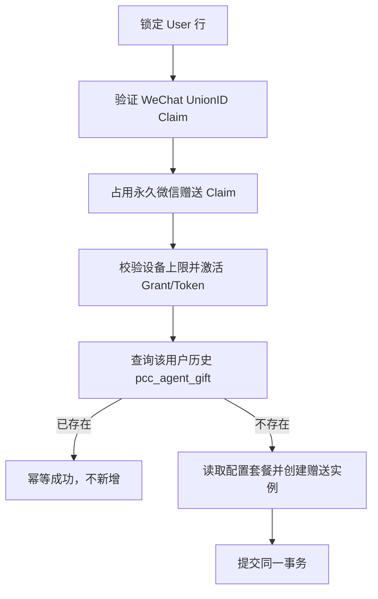
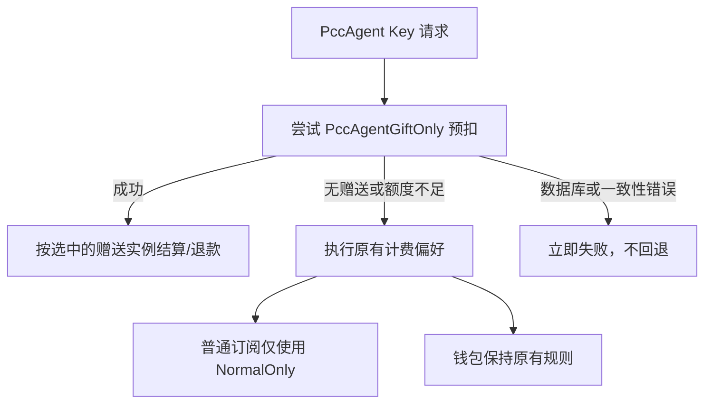

# PccAgent 赠送订阅最小实现 Spec

## 1. 文档状态

- 状态：待评审，未进入业务代码实现
- 目标版本：V1 最小实现
- 变更性质：PccAgent 授权权益、订阅资金来源选择、管理员配置与展示
- 风险等级：高。涉及订阅预扣、结算、退款和购买上限，必须完成本文测试门禁后才能上线

相关现状文档：

- [PccAgent 授权 Token 生命周期](./pcc-agent-authorization-token-lifecycle.md)
- [PccAgent 浏览器授权设计](./pcc-agent-browser-authorization-design.md)
- [动态计费表达式设计](../pkg/billingexpr/expr.md)

## 2. 最终业务定义

管理员可选择一个现有 `SubscriptionPlan`，作为 PccAgent 授权赠送套餐。

用户首次成功激活 PccAgent 授权后，系统自动创建一条独立的
`UserSubscription`：

```text
source = "pcc_agent_gift"
plan_id = 管理员配置的现有套餐 ID
```

该赠送实例只能由该用户的 PccAgent 专用 Key 使用。普通 Key 不能使用。

“选择同一个订阅”表示复用同一条 `SubscriptionPlan` 配置，不表示复用同一条
`UserSubscription`。例如：

| UserSubscription | PlanId | Source | 普通 Key | PccAgent Key |
| --- | ---: | --- | --- | --- |
| 用户自行购买 | 12 | `order` | 可用 | 可用 |
| PccAgent 赠送 | 12 | `pcc_agent_gift` | 不可用 | 优先使用 |

因此，当用户购买的订阅与 `pcc_agent_gift` 属于同一个套餐时，普通 Key 仍然可以
使用用户购买的那条订阅，但不能使用赠送的那条订阅。

## 3. V1 决策摘要

1. 不新增“赠送套餐”表，不新增 PccAgent 用户表，不做数据库迁移。
2. 使用现有 `UserSubscription.Source` 区分赠送实例，固定值为
   `pcc_agent_gift`。
3. 管理员配置保存到现有 `desktop_agent_setting.gift_plan_id`；`0` 表示关闭
   新用户自动赠送。
4. 自动赠送按“用户”执行一次，不按设备执行。授权 10 台设备也只能自动获得一条
   赠送实例。
5. 所有设备生成的 PccAgent Claude/Codex 专用 Key 共用同一条用户赠送订阅额度。
6. V1 不改变现有“每台设备生成 Claude、Codex 两枚 Key”的授权模型。
7. 普通订阅选择必须排除 `source = pcc_agent_gift`。
8. PccAgent Key 固定先尝试赠送订阅；赠送额度不可用时，再执行用户原有的普通
   订阅/钱包计费偏好。
9. 赠送实例不占套餐的 `MaxPurchasePerUser`，也不阻止用户购买同一套餐。
10. 赠送不创建订单、不调用支付、不增加钱包余额、不修改价格和额度换算。
11. 赠送实例不升级或降级用户分组，避免普通 Key 间接获得赠送权益。
12. 自动赠送只执行一次。过期、作废后不会因再次授权而自动重发，V1 不提供补发。
13. `pcc_agent_gift` 只允许作废，不允许硬删除或改写 Source，永久保留领取凭证。
14. `gift_plan_id > 0` 时，PccAgent 授权必须先通过微信 OAuth，并取得稳定的
    WeChat UnionID；仅有密码登录、邮箱或客户端设备 ID 不具备领取资格。
15. 复用现有 `external_identity_claims` 唯一约束记录微信领取权，不新增表或字段。

## 4. 目标与非目标

### 4.1 目标

- 授权成功后安全、幂等地赠送一个管理员配置的现有套餐。
- 保证同一个 WeChat UnionID 只能关联一个领取账号并领取一次。
- 将赠送额度严格限制在 PccAgent 专用 Key。
- 允许普通订阅与赠送订阅使用同一个 `PlanId`，且互不污染。
- 复用现有订阅额度、周期重置、预扣、结算、退款和展示能力。
- 复用现有用户管理和订阅管理界面，不建设第二套用户系统。
- 保持 SQLite、MySQL 和 PostgreSQL 行为一致。

### 4.2 非目标

- 不把多台设备改为全局共用两枚 Token。
- 不新增每天向 `User.Quota` 充值 5 美元的任务。
- 不修改模型价格、分组倍率、动态计费表达式或 quota 换算。
- 不修改支付回调、订单状态机、退款流程或第三方支付参数。
- 不自动迁移已经发放的赠送实例到管理员后来选择的新套餐。
- 不在 V1 增加赠送订阅自动续期。
- 不把 WeChat OAuth 等同于实名/KYC；一个自然人拥有多个微信账号仍属于外部风控边界。

## 5. 数据与配置

### 5.1 数据模型

不新增字段。新增稳定的领域常量：

```go
const UserSubscriptionSourcePccAgentGift = "pcc_agent_gift"
```

普通来源包括现有的 `order`、`admin`、余额购买来源以及历史空值。判断普通订阅时
必须使用：

```sql
source IS NULL OR source <> 'pcc_agent_gift'
```

不能只写 `source <> 'pcc_agent_gift'`，否则历史 `NULL` 数据会被 SQL 三值逻辑
排除。

### 5.2 管理员配置

在现有 `DesktopAgentSetting` 增加：

```go
GiftPlanId int `json:"gift_plan_id"`
```

配置语义：

- `0`：关闭后续自动赠送，不影响已经存在的赠送实例。
- `> 0`：引用现有 `SubscriptionPlan.Id`。
- 保存配置和实际发放时都必须验证套餐存在。
- `gift_plan_id > 0` 时还必须验证微信 OAuth 已启用，且 App ID、App Secret 配置完整。
- 套餐可以与公开售卖套餐相同，也可以是管理员专门创建的套餐。
- 套餐是否允许余额支付、展示价格是多少，不影响赠送发放。
- `TotalAmount = 0` 在现有订阅语义中表示无限额度，配置界面必须明确显示“无限”，
  防止管理员误选。

“每天 5 美元”等价额度由套餐本身表达：

```text
TotalAmount = 5 * QuotaPerUnit
QuotaResetPeriod = daily
```

系统不硬编码 5 美元，也不根据 `PriceAmount` 计算赠送额度。

### 5.3 套餐快照规则

赠送实例复用现有订阅实例的额度、开始时间、结束时间和重置时间计算规则。
`AmountTotal`、`EndTime` 等按创建时套餐数据生成，后续套餐变更遵循现有订阅规则，
不增加 PccAgent 专属同步逻辑。

赠送实例必须覆盖以下分组字段：

```text
UpgradeGroup = ""
PrevUserGroup = ""
DowngradeGroup = ""
```

创建和失效赠送实例时均不得修改 `User.Group`。这是“仅 PccAgent 专用 Key 可用”的
必要边界；否则普通 Key 可能通过用户分组变化间接获得套餐权益。

## 6. 赠送资格与发放

### 6.1 唯一可信触发点

仅在 Desktop Grant 真正进入 `active` 状态时发放：

- 协议 V1：授权码交换事务中，Grant 和两枚 Token 激活时。
- 协议 V2：确认事务中，Grant 从 `awaiting_confirmation` 进入 `active` 时。

当 `gift_plan_id > 0` 时，浏览器授权页在允许用户批准前必须验证该账号已经完成微信
OAuth。没有有效 WeChat UnionID Claim 时，页面只显示“完成微信验证”操作，不允许进入
Grant 批准流程。微信 OAuth 使用现有 session-bound `intent=bind` 流程，回调后返回原
PccAgent 授权页。

以下操作绝不能触发赠送：

- 创建浏览器授权请求。
- 用户在浏览器点击同意。
- 创建 `pending` 或 `awaiting_confirmation` Grant。
- 客户端上报 `plan_id`、金额、套餐名称或 Source。
- 普通登录、注册、支付返回页或未经验证的回调。

发放使用当前已认证 Grant 的服务端 `user_id` 和服务端配置的 `gift_plan_id`，请求体
不接受这两个值。WeChat UnionID 必须来自服务端使用授权码向微信接口换取并校验的 OAuth
响应，不能接受浏览器或 PccAgent 客户端上报的 UnionID/OpenID。

### 6.2 事务边界

当 `gift_plan_id > 0` 时，Grant 激活与首次赠送必须在同一个数据库事务内完成：



任一步数据库操作失败都回滚本次 Grant 激活和赠送创建。不能出现“接口返回授权成功，
但赠送实例创建失败且无人感知”的状态。

配置为 `0` 时跳过微信领取校验和赠送，Grant 按现有流程正常激活。

Grant 数据提交后的 Redis 发布和 Token 缓存失效仍走现有补偿逻辑。若缓存发布失败
导致 Grant 被撤销，已经创建的赠送实例保留；以后重新授权只会恢复对同一实例的访问，
不会重复创建赠送。

### 6.3 幂等和并发

自动发放规则为“每个用户历史上最多自动创建一次”：

```text
EXISTS user_subscriptions
WHERE user_id = ?
  AND source = 'pcc_agent_gift'
```

查询包含 `active`、`expired`、`cancelled`，避免用户通过反复授权重复领取。

所有自动发放必须先使用现有跨数据库兼容的 `lockForUpdate` 锁定 User 行，再检查赠送
实例。并发授权多台设备时，后进入事务的请求必须看到第一条事务已创建的记录。不依赖
只适用于部分数据库的 partial unique index。

V1 不提供补发或重新领取接口。`pcc_agent_gift` 实例：

- 可以被管理员作废，但作废后仍是已领取状态。
- 不允许通过管理员订阅接口硬删除。
- 不允许把 Source 修改为其他值，也不允许把普通实例改成 `pcc_agent_gift`。
- 过期、作废、设备重新授权、套餐配置切换均不会创建第二条。

历史赠送实例负责阻止同一 `user_id` 重领；永久微信赠送 Claim 负责阻止同一微信身份
换账号重领。两者必须同时存在并在同一事务内建立。

### 6.4 授权撤销

撤销或删除某台设备只处理该设备的 Grant 和 Token，不修改赠送订阅。

有效或待确认 Grant 关联的 PccAgent 专用 Key 在 API 密钥页保持只读；Grant 已撤销后，
对应的废弃 Key 允许用户单个或批量删除。删除 Key 时必须在同一事务内清空已撤销 Grant
中的 Token 引用，不能影响同设备的另一枚 Key，也不能删除 Grant 历史。

当用户没有任何有效 PccAgent Key 时，赠送实例自然不可使用。这样可避免设备撤销与
正在进行的订阅预扣/结算相互耦合。管理员可以作废赠送实例，但不能硬删除。

### 6.5 防重复领取与反滥用边界

V1 的领取主体定义为 WeChat UnionID，不使用 OpenID、昵称、头像、邮箱、IP 或普通设备
ID 作为领取身份。UnionID 缺失时，微信登录本身可以按现有规则继续，但不能批准带赠送
权益的 PccAgent 授权。

复用现有 `external_identity_claims` 表及其两个数据库唯一约束：

```text
provider = "wechat_unionid"
subject  = 微信 OAuth 返回的 UnionID
user_id  = 当前绑定账号

provider = "pcc_agent_gift_wechat"
subject  = 同一个 UnionID
user_id  = 首次领取账号
```

`wechat_unionid` Claim 表示当前绑定关系，可以在解绑时释放。
`pcc_agent_gift_wechat` Claim 是永久领取凭证，不得因以下操作释放：

- 解绑微信。
- 删除或注销用户。
- 作废、过期或删除设备 Grant。
- 作废赠送订阅。
- 修改赠送套餐配置。

现有 `releaseAllExternalIdentitiesWithTx` 和微信解绑逻辑必须显式排除
`pcc_agent_gift_wechat`，避免删除账号后清除领取凭证。

发放事务同时依赖两类唯一性：

1. `(provider=pcc_agent_gift_wechat, subject=UnionID)` 保证一个微信身份只能领取一次。
2. `(provider=pcc_agent_gift_wechat, user_id=UserId)` 保证一个账号换绑微信后也不能再领。
3. 历史 `UserSubscription.Source=pcc_agent_gift` 再提供一层账号级防重。
4. User 行锁负责同账号多设备并发；Claim 唯一索引负责跨账号并发。

微信 OAuth 创建用户、登录和绑定时，`wechat_unionid` Claim 必须与用户创建/绑定更新
处于同一数据库事务。不能继续依赖“先查询 WeChatId 是否存在，再更新 User”的
check-then-update 作为唯一性保证。

同一个微信身份并发绑定两个账号时，只允许一个事务提交。相同 UnionID 已经领取后，
即使原账号被删除、微信解绑后绑定新账号，永久 Claim 仍使新账号无法领取。

需要明确：该设计保证的是“一个微信账号一次”，不是公安实名意义上的“一个自然人一次”。
一个自然人拥有多个微信账号仍可能领取多次。生产仍应启用注册 Turnstile、授权接口限流
和异常领取监控，但 IP 或设备摘要只能作为风控信号，不能代替 UnionID 唯一约束。

### 6.6 微信身份兼容与上线前检查

当前微信 Provider 已优先使用 UnionID、缺失时回退 OpenID。赠送资格不能使用这个回退
值，必须单独确认 OAuth 响应中的 `unionid` 非空，并建立 `wechat_unionid` Claim。

上线前执行只读检查：

- 微信 OAuth 已启用且配置完整。
- 微信开放平台网站应用能稳定返回 UnionID。
- 所有参与应用归属同一个微信开放平台主体，避免 UnionID 域不一致。
- `external_identity_claims` 唯一索引在 SQLite、MySQL、PostgreSQL 均存在。
- 存量 `wechat_id` 不直接推断为 UnionID；存量用户需要重新走一次微信 OAuth 后才获得
  赠送资格。

不能在日志、管理列表或错误响应中输出完整 UnionID。管理员界面只展示“微信已验证/未
验证”和脱敏后的领取 Claim 状态。

## 7. Key 身份判定

计费入口使用已有服务端关系判断：

```go
model.IsDesktopGrantToken(relayInfo.UserId, relayInfo.TokenId)
```

前置 Token 鉴权仍负责检查 Token 状态、过期时间和用户状态。不能根据以下内容判断：

- Token 名称或前缀。
- 请求头中的客户端名称。
- Claude/Codex 模型名。
- 用户可修改的 Token 元数据。
- 客户端传入的布尔字段。

身份查询发生数据库错误时必须中止计费并返回系统错误，不能把该 Key 降级为普通 Key
继续执行。

## 8. 订阅选择算法

### 8.1 选择范围

订阅预扣增加内部选择范围，不改变公开 API：

```text
NormalOnly:
  source IS NULL OR source <> pcc_agent_gift

PccAgentGiftOnly:
  source = pcc_agent_gift
```

现有普通订阅入口的默认行为改为 `NormalOnly`。不得保留“任意活跃订阅”查询，否则普通
Key 仍可能选中赠送实例。

以下三个判断必须使用同一个范围，不能只修改预扣查询：

- 是否存在活跃订阅。
- 活跃订阅是否允许钱包溢出。
- 实际预扣选择哪条订阅。

### 8.2 普通 Key

普通 Key 完整保留用户现有计费偏好，但所有订阅操作都使用 `NormalOnly`：

```text
wallet_only          -> 仅钱包
subscription_only    -> 仅普通订阅
wallet_first         -> 钱包，额度不足时尝试普通订阅
subscription_first   -> 普通订阅，按普通订阅规则决定是否回退钱包
```

用户只有 `pcc_agent_gift`、没有普通订阅时，对普通 Key 而言等价于“没有活跃订阅”。

### 8.3 PccAgent 专用 Key

PccAgent Key 在用户计费偏好之前增加一次赠送订阅尝试：



赠送订阅是额外权益，因此其 `AllowWalletOverflow` 不得阻止用户使用自己的普通订阅或
钱包。进入原有计费偏好后，只由普通订阅实例的 `AllowWalletOverflow` 决定钱包回退。

只有以下预期业务结果允许从赠送层回退：

- 没有活跃赠送实例。
- 活跃赠送实例剩余额度不足。

数据库错误、套餐读取错误、重置错误、锁错误、幂等记录冲突等不能伪装成“额度不足”
后回退。V1 应为新选择路径增加可 `errors.Is` 判断的领域错误，不新增字符串匹配。

### 8.4 预扣幂等

`SubscriptionPreConsumeRecord.RequestId` 继续作为唯一幂等键。一旦已有预扣记录，重试
必须继续使用原来的 `UserSubscriptionId`，不能因为套餐重置或配置变化切换资金来源。

已有记录恢复时增加来源校验：

- 普通 Key 只能恢复非赠送订阅记录。
- PccAgent Key 可以恢复赠送或普通订阅记录，因为其原始请求可能已从赠送层回退。
- 来源与 Key 权限不兼容时失败关闭，不能创建第二条预扣记录。

预扣成功后，结算和退款继续只依赖已选定的 `UserSubscriptionId`：

- `PostConsumeUserSubscriptionDelta`
- `RefundSubscriptionPreConsume`
- 异步任务持久化的 `SubscriptionId`

这些函数不重新选套餐，也不按 Source 改写金额。

## 9. 支付与购买上限边界

### 9.1 赠送不是支付

创建 `pcc_agent_gift` 时：

- 不创建 `SubscriptionOrder`。
- 不生成交易号。
- 不调用支付提供商。
- 不进入支付 webhook。
- 不减少或增加用户钱包额度。
- 不读取套餐 `PriceAmount` 作为计费金额。
- 不调用余额购买流程。

所有第三方支付通知和退款路径保持不变。

### 9.2 同套餐购买

`MaxPurchasePerUser` 只统计非赠送实例。支付发起前的计数和订单完成事务内的二次校验
必须同时排除赠送来源：

```sql
(source IS NULL OR source <> 'pcc_agent_gift')
```

否则会出现支付前允许、支付完成后拒绝的竞态。

反方向也必须成立：

- 已购买同一套餐不阻止首次自动赠送。
- 已有赠送不占购买次数。
- 管理员普通绑定仍创建 `source = admin`，普通 Key 可以使用。
- 绝不能把已有 `order`、余额购买或 `admin` 实例原地改成
  `pcc_agent_gift`。

### 9.3 额度计算不变量

本功能只决定“选择哪一个资金来源”，不得修改“请求应该扣多少”：

- `EstimateBilling` 和动态计费表达式不变。
- `QuotaFromFloatChecked`、`QuotaRoundChecked`、`QuotaFromDecimalChecked` 等安全换算不变。
- 预扣额度、最终额度和差额结算的正负方向不变。
- 饱和标记和管理员审计日志不变。
- 赠送订阅同样禁止信任额度旁路，必须先创建订阅预扣记录。
- 任何差额退款都不能超过原订阅实例已使用额度，继续由现有保护负责。

## 10. 管理员体验

### 10.1 系统设置

在现有 PccAgent 设置区域增加“授权赠送套餐”下拉框：

- 数据源复用订阅套餐列表。
- `不赠送` 对应 `gift_plan_id = 0`。
- 选项展示套餐名称、总额度、重置周期和有效期。
- 无限额度套餐必须有明显文字，不允许仅显示 `0`。
- 保存后只影响未来尚未领取过的用户。

### 10.2 PccAgent 授权用户视图

在现有用户管理内增加“PccAgent 授权用户”视图，不创建独立用户实体。复用现有：

- 用户表格、分页、搜索和排序。
- 编辑用户、调整钱包额度、启停用户等操作。
- 用户订阅列表、重置、作废和删除操作。

增加的只读列：

- 活跃设备数。
- 微信验证状态，不展示完整 UnionID。
- 赠送套餐名称。
- 赠送状态。
- 已用额度、总额度、剩余额度。
- 下次重置时间和到期时间。

赠送实例只允许复用现有“作废”动作；隐藏或禁用“硬删除”，且不提供“补发”动作。

列表范围为：

- 存在非 pending 的 Desktop Grant；或
- 存在任意历史 `pcc_agent_gift`。

这样设备全部撤销后，管理员仍能找到并管理其赠送实例。

后端使用分页用户查询加两次批量聚合查询获取设备数和赠送摘要，禁止逐用户 N+1 查询。
查询使用 GORM 子查询和 `IN` 批量查询，兼容 SQLite、MySQL 和 PostgreSQL。

### 10.3 PccAgent 客户端展示

现有 `/api/desktop/subscriptions` 已返回用户活跃订阅及额度，V1 继续复用。赠送实例和
普通实例可以同时返回；客户端不参与可用性判定。

是否允许某枚 Key 消费某条订阅，始终由服务端计费选择规则决定。不能因客户端隐藏或
显示某条订阅而改变权限。

## 11. 接口与权限

新增或扩展的管理能力必须位于现有管理员鉴权和支付合规检查之后：

- 系统设置：扩展现有 Option 更新接口，增加 `desktop_agent_setting.gift_plan_id`。
- 授权用户列表：扩展现有用户查询参数或增加 PccAgent 管理查询，但返回仍复用用户 DTO。

PccAgent 浏览器授权查询需要返回服务端计算的 `wechat_verification_required` 和
`wechat_verified` 状态，用于决定是否显示微信验证流程。响应不能包含 UnionID。

现有订阅硬删除接口遇到 `source = pcc_agent_gift` 时必须返回领域冲突错误。作废、额度
重置和配置变更都必须写入现有管理员审计日志。用户侧没有赠送实例管理接口。

## 12. 失败处理

| 场景 | 处理 |
| --- | --- |
| `gift_plan_id = 0` | 授权正常完成，不创建赠送 |
| 赠送已启用但微信 OAuth 配置不完整 | 拒绝保存配置；运行时失败关闭 |
| 用户没有 `wechat_unionid` Claim | 不允许批准 PccAgent 授权，提示完成微信验证 |
| 微信 OAuth 没有返回 UnionID | 不建立领取资格，不能回退 OpenID |
| UnionID 已被其他账号领取 | 拒绝授权和赠送，不泄露原领取账号 |
| 同一 UnionID 并发绑定或领取 | 数据库唯一约束只允许一个事务提交 |
| 配置套餐不存在 | Grant 激活事务失败并回滚，记录系统错误 |
| 用户已有历史赠送 | 自动发放幂等成功，不新增 |
| 两台设备并发首次授权 | User 行锁串行化，只创建一条 |
| 赠送额度不足 | PccAgent Key 进入原有普通计费偏好 |
| 赠送查询数据库错误 | 请求失败，不回退普通资金来源 |
| 普通 Key 只有赠送实例 | 视为无普通订阅 |
| 套餐配置后来变更 | 已发实例不迁移，也不再次发放 |
| 所有设备被撤销 | 赠送保留但不可被无效 Key 使用 |
| 管理员作废赠送 | 永久保留领取凭证，不自动重发 |
| 管理员尝试硬删除赠送 | 拒绝并记录审计 |

不得吞掉赠送创建、来源识别和订阅查询错误。错误日志至少包含请求 ID、用户 ID、Token
ID 或 Grant 公共 ID、配置套餐 ID，不能记录 Token Key、授权码、确认 Token 或完整
WeChat UnionID。

## 13. 实现范围

预计只修改以下既有边界，具体文件以实现时现状为准：

| 层 | 最小变更 |
| --- | --- |
| `setting/operation_setting` | 增加 `gift_plan_id` 配置 |
| `oauth/wechat.go` | 将服务端返回的 UnionID 作为赠送资格身份，禁止赠送资格回退 OpenID |
| `model/external_identity_claim.go` | 增加微信绑定与永久赠送 Claim 类型，永久 Claim 不随用户删除释放 |
| `controller/oauth.go` | 微信创建、登录、绑定事务内原子写入 `wechat_unionid` Claim |
| `model/subscription.go` | Source 常量、赠送创建、来源过滤、购买计数过滤 |
| `model/desktop_grant.go` | V2 确认事务内执行幂等赠送 |
| `service/desktop_authorization.go` | 微信资格校验，V1/V2 传入服务端套餐配置 |
| `service/billing_session.go` | PccAgent 赠送优先和普通资金来源回退 |
| `service/funding_source.go` | 订阅选择范围传递 |
| `controller/subscription.go` | 禁止硬删除赠送实例并记录审计 |
| `controller/token.go` / `model/token.go` | 仅允许删除已撤销 Grant 的废弃 PccAgent Key，并原子清理关联引用 |
| `controller/user.go` / `model/user.go` | PccAgent 管理视图的筛选与批量摘要 |
| `web/src/features/system-settings` | 套餐选择配置 |
| `web/src/features/users` | 复用用户表格增加 PccAgent 视图和赠送摘要 |
| i18n | 补齐所有现有前端语言 |

明确不修改：

- `pkg/billingexpr`
- 各支付提供商回调业务
- quota 换算和价格计算
- Relay Provider/Channel 适配器
- Desktop Token 的每设备生成规则
- 数据库结构和迁移

## 14. 测试门禁

### 14.1 发放与并发

- 配置为 0 时授权成功且不创建赠送。
- 赠送启用时，没有微信验证的用户不能批准 PccAgent 授权。
- 微信 OAuth 只返回 OpenID、没有 UnionID 时不能获得赠送资格。
- 微信 OAuth 返回 UnionID 时原子建立 `wechat_unionid` Claim。
- 同一 UnionID 并发绑定两个用户只允许一个成功。
- 同一 UnionID 换账号授权不能再次领取。
- 同一账号换绑另一个 UnionID 不能再次领取。
- 用户解绑微信后，普通绑定 Claim 释放，永久赠送 Claim 保留。
- 用户被硬删除后，永久赠送 Claim 保留。
- V1 授权激活时创建一条赠送。
- V2 仅确认成功时创建，交换阶段不创建。
- 同一确认请求重复执行不重复创建。
- 同一用户两台设备并发授权只创建一条。
- 用户已有普通同套餐订阅时仍创建赠送。
- 用户已有任意历史赠送时自动授权不重发。
- 已过期或已作废赠送仍阻止再次领取。
- 管理员硬删除赠送实例被拒绝。
- 配置套餐不存在时 Grant 与赠送均不提交。
- 赠送创建不改变用户分组。

### 14.2 Key 隔离

- 普通 Key 只有赠送实例时不能预扣赠送。
- 普通 Key 同时有普通和赠送实例时只预扣普通实例。
- PccAgent Claude Key 优先预扣赠送实例。
- PccAgent Codex Key 优先预扣同一赠送实例。
- 不同设备的 PccAgent Key 共用同一实例和同一 `AmountUsed`。
- 撤销 Token 后无法继续请求，赠送额度不被修改。
- PccAgent Token 身份查询报错时请求失败，不走普通回退。

### 14.3 回退与计费偏好

- 赠送额度不足后，`wallet_only` 只尝试钱包。
- 赠送额度不足后，`subscription_only` 只尝试普通订阅。
- 赠送额度不足后，`wallet_first` 保持原顺序。
- 赠送额度不足后，`subscription_first` 保持原顺序。
- 赠送实例的 `AllowWalletOverflow = false` 不阻止进入用户原计费偏好。
- 普通严格订阅仍能阻止钱包回退，行为不回归。
- 非“无赠送/额度不足”的错误都不能回退。

### 14.4 预扣、结算和退款

- 赠送预扣创建正确的 `SubscriptionPreConsumeRecord`。
- 相同 RequestId 重试不重复扣费。
- 普通 Key 不能恢复赠送来源的幂等记录。
- PccAgent Key 可以恢复其已回退到普通订阅的记录。
- 同步请求成功结算到原 `UserSubscriptionId`。
- 同步请求失败按原 RequestId 幂等退款。
- 异步任务持久化赠送实例 ID，完成后差额结算正确。
- 异步任务失败退回同一赠送实例。
- 日重置后 `AmountUsed` 按现有规则清零，不增加钱包额度。
- 超大或异常计费输入仍由现有 quota 饱和保护处理，不出现负扣费。

### 14.5 支付与购买

- 有赠送实例时仍可购买同一套餐。
- 赠送不占 `MaxPurchasePerUser`。
- 支付发起计数和订单完成计数都排除赠送。
- 购买生成的实例 Source 不变，普通 Key 可用。
- 管理员普通绑定生成 `admin` 实例，普通 Key 可用。
- 赠送不创建订单，不触发任何支付 Provider。
- 现有 Stripe、Epay、Creem、WaffoPancake 支付回归测试通过。

### 14.6 数据库与前端

- SQLite、MySQL、PostgreSQL 的来源过滤和 User 行锁测试通过。
- SQLite、MySQL、PostgreSQL 的微信 Claim 两个唯一约束均能阻止并发重复领取。
- 管理列表分页总数正确，无 N+1 查询。
- PccAgent 授权页未验证时显示微信验证入口，验证完成后才允许批准。
- 页面和 API 均不泄露完整 UnionID。
- 配置选择器正确显示有限/无限额度。
- 授权用户视图正确展示同 PlanId 的普通与赠送实例。
- 所有新增文案通过 `bun run i18n:sync`。
- 前端 `bun run build` 通过。

## 15. 上线步骤与回滚

1. 先发布后端，默认 `gift_plan_id = 0`，功能保持关闭。
2. 验证微信开放平台能返回 UnionID，并确认 Claim 唯一索引完整。
3. 执行全量后端测试、三数据库重点测试和前端构建。
4. 在测试环境选择有限额度的日重置套餐。
5. 使用新用户完成微信绑定及 V1、V2 授权，验证重复领取拦截、两类 Key 和支付回归。
6. 检查预扣记录、消费日志、管理员审计和订阅额度。
7. 生产环境配置套餐后小范围启用并观察微信验证失败、Claim 冲突、数据库错误与订阅不足
   错误分布。

紧急回滚只需将 `gift_plan_id` 设置为 `0`，立即停止后续自动赠送。已经创建的赠送实例
不会被普通 Key 使用；管理员可按现有订阅管理流程逐条作废，但不得硬删除领取凭证。
回滚不需要修改订单或钱包数据。

## 16. 验收标准

满足以下条件才视为实现完成：

- 同一个套餐下，普通实例和赠送实例可以同时存在。
- 普通 Key 在任何选择顺序下都无法扣赠送实例。
- PccAgent Key 优先扣赠送实例，并在预期业务不足时安全回退。
- 多设备授权不会重复赠送，所有 PccAgent Key 共用一份赠送额度。
- 赠送实例无论活跃、过期或作废都永久阻止该 `user_id` 再次领取。
- 未通过微信 OAuth UnionID 验证的账号不能批准带赠送权益的 PccAgent 授权。
- 同一 UnionID 无论换账号、解绑或删除原账号，都只能领取一次。
- 赠送不改变用户分组，不占购买上限，不触碰订单和钱包。
- 预扣、结算、退款始终绑定同一条订阅实例。
- 授权激活与首次赠送在同一数据库事务内提交或回滚。
- 所有测试门禁通过后才允许将生产 `gift_plan_id` 从 0 改为有效套餐。
