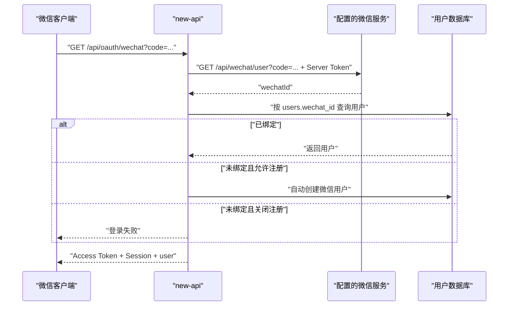

# new-api 微信小程序产品、UI/UX 与接口设计（历史方案）

> [!WARNING]
> 本文记录的是切换微信开放平台标准 OAuth 之前的调研快照，其中第 8 至 12 节基于已经移除的 WeChat Server、公众号验证码和 `/api/oauth/wechat/bind` 接口，不再代表当前实现。当前 Web 登录使用微信开放平台网站应用、`snsapi_login`、`/oauth/wechat` 回调和统一 OAuth state；小程序接入需要基于同一开放平台 `UnionID` 重新设计服务端 `code2Session` 适配，不能照搬本文旧认证链路。

## 1. 文档状态

- 状态：已归档，仅保留产品和历史调研参考
- 日期：2026-07-26
- 范围：微信小程序用户端
- 本阶段产物：产品设计、UI/UX 规范、现有接口盘点、认证可行性与接口缺口
- 本阶段不包含：后端业务逻辑、认证协议、数据库结构或公开 API 的代码修改

> 说明：本文提出的新增接口均为后续方案，不代表当前 new-api 已经提供。涉及认证、公开 API、订阅或计费的后端变更，必须另行评审和批准。

## 2. 产品定位

小程序定位为 new-api 的轻量账户控制台，而不是缩小版 Web 管理后台。用户应当能在手机上快速完成：

1. 查看剩余额度、订阅状态和重置时间。
2. 查看指定周期内的 Token 总量、调用次数和模型使用情况。
3. 查看最常用模型和耗时最长的任务。
4. 查看、创建、启停和管理 API 密钥。
5. 浏览当前账户可用模型及价格。
6. 使用微信身份登录并进入自己的 new-api 账户。

## 3. 目标与非目标

### 3.1 MVP 目标

- 微信登录。
- 账户概览。
- 当前订阅。
- 近 7 天、近 30 天和当前订阅周期的用量统计。
- 可用模型目录。
- API 密钥管理。
- 最近任务与最长任务。
- 个人资料与微信绑定状态。

### 3.2 暂不包含

- 管理员后台。
- 渠道、供应商和系统设置。
- 复杂充值、退款和发票流程。
- 全量日志导出。
- 在小程序内直接调用模型。
- 修改 new-api 现有计费语义。
- 将额度、Token 和货币单位相互混用。

## 4. 信息架构

底部导航使用四个 Tab：

| Tab | 主要内容 |
| --- | --- |
| 概览 | 额度、订阅、Token、最常用模型、最长任务、快捷操作 |
| 模型 | 用户可用模型、搜索、分类、价格与模型详情 |
| 密钥 | 密钥列表、创建、启停、额度、模型限制和安全操作 |
| 我的 | 账户资料、订阅详情、微信绑定状态、登录会话和帮助 |

二级页面：

- 用量详情
- 模型详情
- 密钥详情
- 创建或编辑密钥
- 订阅详情
- 任务详情
- 登录设备

## 5. 视觉方向

### 5.1 视觉主张

> Anthropic 的温暖编辑感，与工业账本式零圆角结构结合。

保留 Anthropic 风格中的暖白画布、深墨文字、陶土橙强调色和编辑式字体层级；移除圆角、胶囊标签、浮动卡片、大面积阴影和渐变。

零圆角不等于所有区域都加边框。页面主要依靠：

- 统一基线。
- 稳定留白。
- `1px` 暖灰分隔线。
- 全宽色带。
- 字体层级。
- 方形网格。

### 5.2 色彩

| Token | 值 | 用途 |
| --- | --- | --- |
| `canvas` | `#FAF9F5` | 页面背景 |
| `ink` | `#141413` | 一级文字 |
| `body` | `#3D3D3A` | 正文 |
| `muted` | `#6C6A64` | 次级文字 |
| `surface-soft` | `#F5F0E8` | 柔和区域 |
| `surface-strong` | `#EFE9DE` | 选中或强调区域 |
| `hairline` | `#E6DFD8` | 分隔线 |
| `primary` | `#D97757` | 主要操作 |
| `primary-active` | `#A9583E` | 按下状态 |
| `success` | `#788C5D` | 正常、成功 |
| `info` | `#6A9BCC` | 信息 |
| `warning` | `#D4A017` | 额度不足、即将到期 |
| `error` | `#C64545` | 失败、停用、删除 |

陶土橙只用于主要操作、选中状态、额度进度和关键数字。普通容器不使用橙色染色。

### 5.3 圆角和阴影

- 全局圆角：`0`。
- 按钮、输入框、弹层、抽屉、列表、Tab、图表柱体均为直角。
- 不使用常规卡片阴影。
- 弹层仅使用背景遮罩、边框和轻微层级阴影表达高度。
- 状态不使用胶囊 Badge，改用方形色块、状态点和文字。

当前 Web 主题系统已存在 Anthropic 配色和零圆角轴，可作为小程序 Token 来源：

- `web/src/styles/theme-presets.css` 中的 `data-theme-preset="anthropic"`
- `web/src/styles/theme-presets.css` 中的 `data-theme-radius="none"`

### 5.4 字体

- 页面标题：`Songti SC`、`Noto Serif SC` 或系统衬线字体。
- 正文、表单、按钮：系统无衬线字体。
- Token、密钥、时间、额度数字：等宽字体。
- 数字启用表格数字，避免数据更新时宽度跳动。
- 字号固定，不随屏幕宽度缩放。
- 字间距保持 `0`，不使用负字间距。

建议字号：

| 场景 | 字号 |
| --- | --- |
| 额度主数字 | `34px` |
| 页面标题 | `24px` |
| 区域标题 | `18px` |
| 列表标题 | `16px` |
| 正文 | `14px` |
| 辅助信息 | `12px` |

### 5.5 布局

- 页面左右间距：`20px`。
- 基础间距单位：`4px`。
- 常用区域间距：`16px`、`24px`、`32px`。
- 最小点击区域：`44px × 44px`。
- 主按钮高度：`48px`。
- 搜索框和普通输入高度：`44px`。
- 底部导航内容高度：`56px`，额外适配安全区。
- 固定格式控件必须有稳定尺寸，加载、数字变化和状态切换不得引发布局跳动。

## 6. 页面设计

### 6.1 登录页

登录页只承担身份确认，不做营销页。

页面内容：

1. 系统名称和简短账户说明。
2. “微信登录”主按钮。
3. 用户协议和隐私政策确认。
4. 必要时提供“使用已有账户登录并绑定微信”的备用入口。
5. 网络错误、未绑定、注册关闭和账户停用的明确状态。

视觉结构：

```text
new-api
账户控制台

使用微信身份访问你的额度、订阅、模型和密钥。

[ 微信登录 ]

□ 我已阅读并同意用户协议与隐私政策
```

登录按钮使用微信图标加文字，圆角为 `0`。不要使用 Anthropic 的品牌标志，只采用其色彩和排版方向。

### 6.2 概览页

```text
账户概览                                      通知
────────────────────────────────────────────
可用额度
¥ 86.42
本周期已使用 ¥13.58
████████████████──────── 68%
8 月 18 日重置
────────────────────────────────────────────
专业版 · 月付                              →
正常 · 允许余额补充
────────────────────────────────────────────
用量概览                   7天  30天  本周期
──────────────────────┬─────────────────────
已用 Token             │ Token 最多模型
12.8M                  │ GPT-5
较上期 +8.4%            │ 6.2M · 48%
──────────────────────┼─────────────────────
最长任务                │ 调用次数
12分42秒                │ 18,429
Veo · 视频生成           │ 成功率 98.7%
──────────────────────┴─────────────────────
创建密钥                                      →
查看可用模型                                  →
查看用量记录                                  →
```

规则：

- 额度区域是全宽信息带，不放进悬浮卡片。
- 四个指标使用共享边框的 `2 × 2` 网格。
- 时间范围使用方形分段控件。
- 每个指标必须显示统计周期。
- 最常用模型默认按 Token 消耗排序。
- 最长任务默认按提交到完成的总耗时排序。
- 标题右侧显示数据更新时间。

### 6.3 模型页

- 顶部为固定搜索框。
- 分类使用下划线 Tab，不使用胶囊。
- 模型列表使用全宽行和分隔线。
- 模型名称、厂商、模态和价格保持稳定对齐。
- 模型 ID 使用复制图标。
- 模型详情使用属性表，不使用多层卡片。

模型列表行：

```text
Claude 4 Sonnet                              →
Anthropic · 文本 · 推理
输入 ¥… / 1M                  输出 ¥… / 1M
────────────────────────────────────────────
```

模型详情：

- 模型 ID
- 厂商
- 可用分组
- 输入价格
- 输出价格
- 计费模式
- 支持端点
- 标签和描述

上下文长度、最大输出 Token、实时可用状态只有在后端明确提供时才展示，不在客户端猜测。

### 6.4 密钥页

列表使用掩码密钥：

```text
API 密钥                                      ＋
────────────────────────────────────────────
生产环境                                     ■
sk-••••••••7K2P                              →
今日 238 次 · 最后使用 3 分钟前
额度不限 · 全部模型
────────────────────────────────────────────
```

交互：

- 创建使用方形加号图标。
- 启停使用方形 Toggle 或 Checkbox。
- 点击进入详情。
- 完整密钥默认隐藏。
- 查看完整密钥前显示二次确认。
- 删除放在详情页危险操作区，不提供无确认的左滑删除。
- 复制完成后提供轻量反馈。

### 6.5 订阅页

当前套餐使用全宽深色信息带，不与其他卡片嵌套。

```text
当前订阅
────────────────────────────────────────────
专业版
¥ 99 / 月
2026 年 8 月 18 日到期

已使用 68%
████████████████────────

总额度                              100M Token
已使用                               68M Token
下次重置                            8 月 18 日
余额补充                                  开启
────────────────────────────────────────────
管理订阅
```

套餐列表使用纵向全宽区块。推荐套餐通过左侧 `3px` 陶土橙竖线强调，不使用悬浮卡片或推荐胶囊。

### 6.6 用量与任务

用量页包含：

- Token 趋势
- 请求次数趋势
- 模型 Token 排名
- 模型调用次数排名
- 密钥用量排名
- 最近任务
- 最长任务

图表规则：

- 图表背景透明。
- 网格线为暖灰色。
- 主数据使用陶土橙。
- 对比周期使用橄榄绿或浅蓝。
- 所有柱形为直角。
- 图表下方直接连接数据列表，不再包第二层卡片。

任务总耗时定义：

```text
总耗时 = finish_time - submit_time
执行耗时 = finish_time - start_time
排队耗时 = start_time - submit_time
```

仅统计时间字段有效且已结束的任务。进行中任务不参与最长任务排名。

## 7. 数据口径

### 7.1 额度

- `quota`：账户当前剩余额度。
- `used_quota`：已使用额度，不是已使用 Token。
- 额度根据 `/api/status` 返回的显示类型转换为货币、Token 或自定义单位。

### 7.2 已用 Token

指定周期内：

```text
已用 Token = Σ token_used
```

数据来自 `quota_data` 聚合结果。不能使用 `/api/log/self/stat` 的 `tpm` 作为累计 Token，因为该字段实际只统计最近 60 秒。

### 7.3 最常用模型

首页默认口径：

```text
模型 Token = 按 model_name 汇总 token_used
最常用模型 = 模型 Token 最大的模型
```

用量详情页同时提供：

```text
调用最多模型 = 按 model_name 汇总 count 后排名第一
```

### 7.4 最长任务

默认使用：

```text
finish_time - submit_time
```

这与当前 Web 任务列表展示的“总耗时”口径一致，包含排队时间。

### 7.5 统计周期

MVP 支持：

- 近 7 天
- 近 30 天
- 当前订阅周期

现有用户数据聚合接口单次最多查询 30 天，因此“历史累计 Token”不能直接由一个现有请求准确获得。

## 8. 当前可复用接口

除特别说明外，以下用户接口都需要 `Authorization: Bearer <access_token>`。

### 8.1 系统状态

| 接口 | 鉴权 | 需要字段 | 用途 |
| --- | --- | --- | --- |
| `GET /api/status` | 无 | `system_name`、`logo`、`quota_per_unit`、`quota_display_type`、`display_in_currency`、`enable_task`、`enable_data_export`、`wechat_login` | 启动配置与功能开关 |

### 8.2 登录与用户身份

| 接口 | 鉴权 | 需要字段 | 用途 |
| --- | --- | --- | --- |
| `GET /api/oauth/wechat?code=...` | 无，限流 | `access_token`、`access_expires_at`、`session`、`user` | 现有微信登录 |
| `POST /api/user/auth/refresh` | Refresh Cookie | 新 Access Token、用户、Session | 刷新登录 |
| `POST /api/user/auth/logout` | Cookie，可带 Bearer | 撤销当前登录会话 | 退出登录 |
| `GET /api/user/self` | Bearer | `id`、`username`、`display_name`、`email`、`wechat_id`、`group`、`quota`、`used_quota`、`request_count` | 当前用户基础信息 |
| `POST /api/oauth/wechat/bind` | Bearer | 成功状态 | 将微信绑定到当前已登录用户 |
| `GET /api/user/sessions` | Bearer Session | 登录设备列表 | 设备与会话管理 |

### 8.3 概览和用量

| 接口 | 鉴权 | 需要字段 | 用途 | 限制 |
| --- | --- | --- | --- | --- |
| `GET /api/data/self` | Bearer | `model_name`、`created_at`、`token_used`、`count`、`quota` | Token 总量、模型排名、趋势 | 单次最多 30 天，依赖数据导出开关 |
| `GET /api/data/flow/self` | Bearer | `token_id`、`token_name`、`use_group`、`model_name`、`token_used`、`count`、`quota` | 密钥、分组和模型聚合 | 单次最多 30 天，仅聚合有效用量流 |
| `GET /api/log/self` | Bearer | `model_name`、`prompt_tokens`、`completion_tokens`、`use_time`、`token_name` | 最近普通请求详情 | 每页最多 100 条 |
| `GET /api/log/self/stat` | Bearer | `quota` | 周期额度汇总 | `tpm` 不是周期累计 Token |

`/api/data/self` 查询参数：

```text
start_timestamp=<Unix 秒>
end_timestamp=<Unix 秒>
```

仓库中还存在 `GET /api/desktop/usage/summary`，但它不能直接作为小程序现有接口使用：

- 它要求 Desktop Access Token 和 `usage.read` scope，不接受面板登录返回的 Access Token。
- Desktop 授权流程固定服务于 `pcc-agent-desktop`，回调地址只接受本机 `127.0.0.1`。
- 其 `longest_task_seconds` 是按相邻活动间隔不超过 30 分钟计算的连续活动时段，不是 `/api/task/self` 中单个异步任务的耗时。

因此不应为了“零新增”而让小程序伪装成 Desktop 客户端，也不能把该字段直接展示为“最长任务”。

### 8.4 任务

| 接口 | 鉴权 | 需要字段 | 用途 | 限制 |
| --- | --- | --- | --- | --- |
| `GET /api/task/self` | Bearer | `task_id`、`platform`、`action`、`status`、`submit_time`、`start_time`、`finish_time`、`properties`、`progress` | 任务列表与耗时计算 | 按最新任务排序，不支持按耗时排序，每页最多 100 条 |

支持的查询条件：

- `p`
- `page_size`
- `start_timestamp`
- `end_timestamp`
- `platform`
- `task_id`
- `status`
- `action`

### 8.5 订阅

| 接口 | 鉴权 | 需要字段 | 用途 | 限制 |
| --- | --- | --- | --- | --- |
| `GET /api/subscription/self` | Bearer | `billing_preference`、`subscriptions`、`all_subscriptions` | 当前和历史订阅 | 订阅记录只含 `plan_id`，不含套餐标题 |
| `GET /api/subscription/plans` | Bearer | 套餐 ID、标题、价格、周期、总额度、重置策略 | 按 `plan_id` 补全套餐信息 | 需和订阅接口合并 |

### 8.6 密钥

| 接口 | 鉴权 | 用途 |
| --- | --- | --- |
| `GET /api/token/?p=1&size=20` | Bearer | 分页读取密钥 |
| `GET /api/token/:id` | Bearer | 密钥详情 |
| `POST /api/token/` | Bearer | 创建密钥 |
| `PUT /api/token/` | Bearer | 更新密钥 |
| `PUT /api/token/?status_only=true` | Bearer | 启停密钥 |
| `DELETE /api/token/:id` | Bearer | 删除密钥 |
| `POST /api/token/:id/key` | Bearer，关键操作限流 | 查看完整密钥 |

密钥列表已有：

- 掩码后的 `key`
- `status`
- `name`
- `created_time`
- `accessed_time`
- `expired_time`
- `remain_quota`
- `used_quota`
- `unlimited_quota`
- `model_limits`
- `allow_ips`
- `group`

密钥自身的 `used_quota` 是额度，不是 Token。指定周期内的密钥 Token 使用量应从 `/api/data/flow/self` 按 `token_id` 汇总。

### 8.7 模型

| 接口 | 鉴权 | 用途 | 使用方式 |
| --- | --- | --- | --- |
| `GET /api/user/models` | Bearer | 当前用户实际可用模型名称 | 作为可用集合 |
| `GET /api/pricing` | 由定价模块访问策略决定，建议带 Bearer | 模型描述、图标、厂商、价格、分组和端点 | 按 `model_name` 与可用集合合并 |

模型页的数据合并规则：

1. `/api/user/models` 决定用户是否可用。
2. `/api/pricing` 补充价格、描述、图标、厂商、标签和支持端点。
3. 没有定价元数据的可用模型仍显示，但标注“暂无详细信息”。
4. 不根据模型名称猜测上下文长度或能力。

## 9. 微信登录现状与结论

### 9.1 当前实现

当前 new-api 已存在：

```text
GET /api/oauth/wechat?code=<code>
```

服务端流程：



登录成功响应中的 `user` 已包含：

- `id`
- `username`
- `display_name`
- `email`
- `wechat_id`
- `group`
- `quota`
- `used_quota`
- `request_count`

后续也可以通过 `GET /api/user/self` 重新获取这些信息。

### 9.2 “通过微信绑定信息获得用户 ID”是否已有

结论：**服务端内部已经能够完成，客户端不需要也不应该单独按微信 ID 查询用户 ID。**

现有微信登录接口会：

1. 将 `code` 交给配置的微信服务换取 `wechatId`。
2. 使用 `wechatId` 查询 `users.wechat_id`。
3. 找到用户后创建登录 Session。
4. 在登录响应 `data.user.id` 中返回用户 ID 和基础信息。

当前没有提供“未登录状态下，传入微信 ID 后直接返回用户 ID”的公开接口。这是合理的安全边界，避免泄露微信身份与 new-api 账户的映射关系。

后续用户接口也不应信任客户端提交的 `user_id`。服务端应继续从 Bearer Token 和 Session 中取得当前用户 ID。

### 9.3 已登录用户绑定微信

当前已有：

```text
POST /api/oauth/wechat/bind
Authorization: Bearer <access_token>

{
  "code": "..."
}
```

它适用于“用户先通过密码、Passkey 或其他 OAuth 登录，再绑定微信”的场景。绑定成功后调用 `/api/user/self` 可读取 `wechat_id`。

### 9.4 当前实现不能直接确认的部分

当前 Web UI 明确要求用户扫描公众号二维码、回复“验证码”，再手工输入验证码。因此现有产品中的 `code` 语义是公众号验证码，不是小程序 `wx.login()` code。

后端没有直接调用微信小程序官方 `code2Session`。它依赖：

- `WeChatServerAddress`
- `WeChatServerToken`
- 外部服务的 `/api/wechat/user?code=...`

因此目前只能确认：

- new-api 能根据外部服务返回的 `wechatId` 查找绑定用户。
- new-api 能返回统一登录数据和 Bearer Token。

目前不能仅从仓库确认：

- 外部微信服务是否接受 `wx.login()` 产生的小程序临时 code。
- 返回的是小程序 `openid`、开放平台 `unionid`，还是其他微信标识。
- 公众号、开放平台扫码登录与小程序登录是否共享同一个账户标识。
- `wx.request` 是否能在目标部署中可靠保存并发送当前 HttpOnly Refresh Cookie。
- Secure 模式下的 Refresh Origin/Referer 校验是否与小程序网络环境兼容。

这些必须在真实 AppID、真实部署域名和真机环境中完成 PoC。

### 9.5 当前登录行为的产品风险

当微信身份没有绑定用户时：

- 如果 `RegisterEnabled=true`，现有接口会自动创建新用户。
- 如果 `RegisterEnabled=false`，现有接口直接返回失败。

当前响应没有结构化区分：

- 已绑定并登录。
- 未绑定。
- 自动注册成功。
- 注册关闭。
- 账户已删除。

如果产品目标是“仅允许已存在的 new-api 用户通过微信登录”，MVP 应先要求用户在 Web 端绑定微信，或者补充明确的绑定流程。不能让未绑定用户在不知情的情况下创建第二个账户。

## 10. 会话兼容性

当前登录会话模型：

- Access Token：JWT，有效期 15 分钟。
- Refresh Token：HttpOnly、`SameSite=Strict` Cookie。
- Login Session：服务端记录，有效期最长 30 天。
- 业务请求：`Authorization: Bearer <access_token>`。
- 刷新：`POST /api/user/auth/refresh`。

小程序需要验证：

1. 登录响应的 `Set-Cookie` 是否被 `wx.request` 保存。
2. 后续刷新请求是否自动携带该 Cookie。
3. Cookie 的 Path `/api/user/auth` 是否生效。
4. `SameSite=Strict` 是否阻止小程序场景发送 Cookie。
5. `SESSION_COOKIE_SECURE=true` 时，Origin/Referer 校验是否接受小程序来源。
6. Access Token 过期后能否稳定刷新，而不是反复执行微信登录。

不建议每 15 分钟重新调用微信登录，因为每次登录都会创建新的服务端 Session，可能触发活跃 Session 和每日签发数量限制。

## 11. 接口缺口

### 11.1 零新增优先审查结论

业务数据接口可以做到 **new-api 零新增**。推荐把以下工作放在小程序服务端或现有 `WeChatServerAddress` 对应的微信身份服务中：

1. 接收 `wx.login()` code，并调用微信 `code2Session`。
2. 将微信身份转换成与现有 `users.wechat_id` 一致的稳定标识。
3. 生成一次性票据，避免把真实 `wx.login()` code 放进 new-api GET URL。
4. 使用一次性票据代小程序调用现有 `GET /api/oauth/wechat?code=...`。
5. 在服务端保存 new-api 返回的 HttpOnly Refresh Cookie。
6. 向小程序签发独立、可撤销的短期小程序会话。
7. 使用该会话代理业务请求，或在服务端刷新 new-api Access Token 后再返回短期 Access Token。

这种方式不修改 new-api 的认证、数据库或公开 API，并避免把管理 PAT 或 Refresh Token 放进小程序本地存储。

严格零新增时，产品口径需要收敛：

| 产品字段 | 零新增实现 | 必须接受的限制 |
| --- | --- | --- |
| 剩余额度 | `/api/user/self` | 无 |
| 当前订阅 | `/api/subscription/self` | 套餐标题需要与 `/api/subscription/plans` 客户端合并 |
| 已用 Token | `/api/data/self` 客户端求和 | 只标注为所选周期或近 30 天，且依赖数据导出开启 |
| 最常用模型 | `/api/data/self` 按 `model_name` 求和 | 只代表所选周期 |
| 最长异步任务 | 分页读取 `/api/task/self` 后计算 | 数据量大时请求次数较多 |
| 密钥管理 | `/api/token/*` | 创建成功后需重新拉取列表，再按 ID 查看完整密钥 |
| 可用模型 | `/api/user/models` | 价格详情依赖 `/api/pricing` 模块可用 |

以下做法虽然也能勉强做到接口零新增，但不应采用：

- 每 15 分钟重新执行微信登录：会不断创建 Login Session，并触发会话数量或签发频率限制。
- 调用 `GET /api/user/token` 生成管理 PAT 并长期存进小程序：权限过大，还会覆盖用户现有管理 PAT。
- 把 Desktop OAuth 当作小程序授权：客户端、回调地址、scope 和业务语义都不匹配。
- 分页扫描全部日志计算历史 Token：成本高，并受日志清理策略影响，结果不一定是全生命周期数据。

订阅标题也存在一个边界：`/api/subscription/self` 只返回 `plan_id`，而 `/api/subscription/plans` 只返回当前启用且支付合规开关允许展示的套餐。历史套餐或已停用套餐可能无法补全标题。零新增 MVP 应回退显示“当前订阅”及额度、到期时间，不强制显示套餐标题。

另一个上线门槛是 IP 限流：微信登录和 Session 刷新都使用按 `ClientIP` 计算的 `CriticalRateLimit`。如果 BFF 不向受信任的 new-api 代理链传递真实客户端 IP，全部小程序用户会共享 BFF 出口 IP 的限流桶。零代码方案需要精确配置 `TRUSTED_PROXIES`、规范转发客户端 IP，并完成并发压测；不能简单关闭限流。

### 11.2 P0：微信小程序认证兼容性

| 缺口 | 影响 | 当前临时方案 | 建议 |
| --- | --- | --- | --- |
| 无法确认当前微信服务接受 `wx.login()` code | 可能无法登录 | 真机 PoC | 明确小程序 code 交换契约 |
| `wechat_id` 的 openid/unionid 语义不明确 | 可能产生重复账户或错误绑定 | 限定单一微信应用来源 | 明确身份主键策略 |
| Refresh Cookie 与小程序兼容性未验证 | 15 分钟后可能失去登录 | 真机验证 Cookie 和 Origin | 必要时设计小程序专用会话刷新 |
| 未绑定状态缺少结构化错误码 | 无法给出准确 UI | 根据 message 降级 | 返回稳定的绑定状态和错误码 |
| 自动注册可能创建重复账户 | 用户资产被分散 | MVP 关闭自动注册或要求预绑定 | 明确“登录、注册、绑定”状态机 |

后续可能需要的专用接口，仅为提案：

```text
POST /api/miniapp/auth/wechat
```

建议请求体：

```json
{
  "code": "wx.login temporary code"
}
```

建议返回统一 Auth Bundle，并额外提供稳定状态：

```json
{
  "success": true,
  "data": {
    "binding_state": "bound",
    "access_token": "...",
    "access_expires_at": 0,
    "session": {},
    "user": {}
  }
}
```

是否新增该接口、如何刷新以及如何存储客户端凭据，属于认证架构变更，必须单独进行安全评审。

### 11.3 P1：概览聚合

当前首页需要并行请求多个接口。现有接口可以完成 MVP，但首屏延迟和客户端计算较多。

缺少：

- 周期 Token 总量的一次性摘要。
- 最常用模型及占比。
- 数据更新时间。
- 最长任务。
- 当前订阅和套餐标题的合并结果。

可选的后续聚合接口：

```text
GET /api/data/self/summary?start_timestamp=...&end_timestamp=...
```

建议数据：

```json
{
  "total_tokens": 12800000,
  "total_requests": 18429,
  "total_quota": 0,
  "top_model": {
    "model_name": "gpt-5",
    "token_used": 6200000,
    "request_count": 4200,
    "share": 0.484
  },
  "data_updated_at": 0
}
```

### 11.4 P1：历史累计 Token

现有 `/api/data/self` 单次最多查询 30 天。缺少：

- 用户全生命周期 Token 总量。
- 当前订阅完整周期超过 30 天时的一次性聚合。
- 按密钥的全生命周期 Token 总量。

MVP 应使用“近 7 天”“近 30 天”或“当前周期内可查询范围”，不要错误标注为“累计总量”。

### 11.5 P1：最长任务

现有 `/api/task/self`：

- 只按最新任务排序。
- 每页最多 100 条。
- 不支持按耗时排序。
- 不返回最长任务摘要。

客户端可以遍历周期内全部分页后计算，但不适合作为长期方案。

后续可考虑：

```text
GET /api/task/self/summary?start_timestamp=...&end_timestamp=...
```

返回最长已完成任务、总耗时、执行耗时和任务基础信息。

### 11.6 P2：模型详情

现有接口能够获得可用模型名称、价格、厂商、描述、标签和支持端点，但缺少稳定的：

- 上下文长度。
- 最大输出 Token。
- 当前健康状态。
- 最近可用率。
- 平均响应延迟。

MVP 不展示这些字段，除非后端明确返回。

### 11.7 P2：通知

缺少：

- 额度阈值设置。
- 额度不足通知。
- 订阅到期通知。
- 密钥异常使用通知。
- 微信订阅消息授权和发送状态。

这些属于第二阶段能力。

## 12. MVP 请求编排

### 12.1 启动

```text
GET /api/status
```

读取系统名称、显示单位、微信登录开关和功能开关。

### 12.2 登录

```text
wx.login()
  -> 当前 GET /api/oauth/wechat?code=...
  -> 保存内存 Access Token 与 Session ID
  -> 验证 Refresh Cookie
```

### 12.3 概览

登录后并行请求：

```text
GET /api/user/self
GET /api/subscription/self
GET /api/subscription/plans
GET /api/data/self
GET /api/task/self
```

优化：

- 用户信息缓存 1 分钟。
- 套餐目录缓存 10 分钟。
- 模型目录缓存 10 分钟。
- 用量数据缓存 1 分钟。
- 下拉刷新时主动失效概览查询。
- 最长任务仅在进入页面、切换周期或主动刷新时重新计算。

### 12.4 模型

并行请求：

```text
GET /api/user/models
GET /api/pricing
```

按模型名称合并。

### 12.5 密钥

```text
GET /api/token/?p=1&size=20
GET /api/data/flow/self
```

按 `token_id` 合并周期 Token、请求次数和额度使用。

## 13. 安全要求

- 客户端不得使用 `wechat_id` 或 `user_id` 作为授权依据。
- 所有用户数据由 Bearer Token 对应的服务端 Session 决定。
- 不提供未登录的微信 ID 到用户 ID 映射查询。
- Access Token 不写入日志、埋点或错误上报。
- 完整密钥默认隐藏。
- 查看、复制、删除密钥需要明确交互反馈。
- 不在页面切入后台后继续显示完整密钥。
- 登录响应、账户信息和密钥接口均禁止业务缓存到公共 CDN。
- 微信临时 code 不应长期保存。
- 若新增小程序认证接口，优先使用 POST 请求体，避免 code 出现在 URL 和访问日志中。
- 小程序请求域名必须使用 HTTPS 并加入微信后台合法域名。

## 14. 加载、空状态和错误状态

### 14.1 加载

- 使用直角暖灰骨架屏。
- 保持最终内容尺寸，避免布局跳动。
- 首屏优先加载额度与订阅，模型和任务可以后到。

### 14.2 空状态

示例：

- 无订阅：“当前没有有效订阅。”
- 无密钥：“尚未创建 API 密钥。”
- 无模型数据：“当前账户没有可用模型。”
- 无任务：“当前周期没有任务记录。”
- 无用量：“当前周期尚无调用记录。”

每个空状态最多提供一个主要操作。

### 14.3 错误

- 网络失败时保留已有缓存，并标注“数据可能已过期”。
- Access Token 过期优先刷新。
- Refresh 失败后回到登录页。
- 微信未绑定、注册关闭、账户停用必须使用不同页面状态。
- `/api/data/self` 不可用时，额度和订阅仍应正常展示。

## 15. 动效

- 页面进入：`160ms` 淡入并上移 `6px`。
- 数据范围切换：内容交叉淡化。
- 额度进度：`400ms` 从左向右展开。
- 按钮按下：背景加深，不缩放、不弹跳。
- 页面切换：轻微横向推进。
- 骨架屏使用低对比度明暗变化。
- 尊重系统减少动态效果设置。

## 16. 可访问性

- 正文对比度满足 WCAG AA。
- 点击区域至少 `44px × 44px`。
- 图标按钮必须有可访问名称。
- 状态不能只依赖颜色。
- 图表提供数字摘要和列表替代。
- 密钥、模型 ID 和任务 ID 支持长按或按钮复制。
- 超长模型名称必须换行或截断，不能覆盖价格和操作区。
- 底部安全区、系统字号和横屏异常状态需要验证。

## 17. 实施阶段

### 阶段 0：认证 PoC

验收条件：

1. `wx.login()` code 能通过当前微信服务换取稳定身份。
2. 已绑定用户能得到正确的 `data.user.id` 和 `wechat_id`。
3. 未绑定用户不会意外创建重复账户。
4. Access Token 可调用 `/api/user/self`。
5. 15 分钟后能刷新或稳定恢复登录。
6. 真机冷启动后能恢复会话。
7. 退出登录能撤销服务端 Session。

认证 PoC 未通过前，不进入完整页面开发。

### 阶段 1：只读 MVP

- 登录
- 概览
- 订阅
- 用量
- 模型目录
- 密钥只读列表
- 任务列表

### 阶段 2：密钥操作

- 创建
- 编辑
- 启停
- 查看完整密钥
- 删除
- 安全确认

### 阶段 3：体验增强

- 首页聚合接口
- 最长任务摘要
- 历史累计 Token
- 额度和订阅通知
- 微信订阅消息

## 18. 当前结论

1. 当前 new-api 已经能在服务端根据 `wechat_id` 查询绑定用户。
2. 当前微信登录成功后已经返回用户 ID、基础信息、Access Token 和 Session。
3. 登录后通过 `/api/user/self` 可以读取 `wechat_id` 和账户基础数据。
4. 不需要新增公开的“微信 ID 查询用户 ID”接口，也不应让客户端执行这种查询。
5. 当前实现能否直接接受小程序 `wx.login()` code，取决于外部微信服务，仓库本身无法证明。
6. 当前 Refresh Cookie 和 Origin 校验能否在小程序中稳定工作，需要真机 PoC。
7. 额度、订阅、近 30 天 Token、模型排行、密钥和模型目录均可用现有接口完成。
8. 全生命周期 Token、一次性首页摘要和准确最长任务缺少高效的现成接口。
9. 推荐采用小程序服务端/BFF 保存 Refresh Cookie 并复用现有接口；按此架构，new-api 可以保持零新增。
10. 如果小程序必须直接请求 new-api，则认证层大概率需要小程序专用登录与刷新契约；不建议用管理 PAT、重复微信登录或 Desktop OAuth 绕过。
11. 后续最先处理的不是页面开发，而是微信身份主键和会话刷新链路的真机 PoC。
