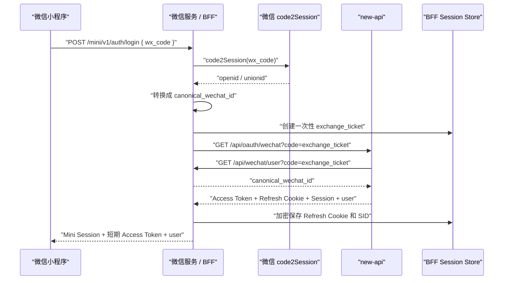

# new-api 微信小程序旧版零改动接入方案（已归档）

> [!WARNING]
> 本文依赖旧 WeChat Server、公众号验证码以及 `/api/oauth/wechat` 的非标准登录语义。相关实现已经由微信开放平台网站应用标准 OAuth 取代，因此本文不能作为当前实施方案。保留它仅用于解释历史设计与迁移风险；新的小程序方案应通过 `wx.login()`、服务端 `code2Session` 和同一开放平台下的 `UnionID` 适配当前 new-api。

## 1. 决策

目标是让微信小程序复用当前 new-api，不修改：

- new-api 登录、Session 和 Bearer 鉴权实现。
- 数据库结构和 `users.wechat_id` 字段。
- 用户、订阅、用量、任务、密钥和模型 API。
- 现有 Web 端公众号验证码登录。

推荐方案：

```text
小程序直接调用现有业务 API
             +
现有微信服务承担登录、Refresh Cookie 保管和 Access Token 刷新
```

这里的“现有微信服务”是 `WeChatServerAddress` 指向的服务。本文将它称为 BFF。BFF 可以部署在独立服务、微信云托管或现有微信服务中，但不进入 new-api 仓库。

## 2. 已确认的当前行为

### 2.1 当前微信 code 不是小程序 code

当前 Web 端流程要求用户：

1. 扫描公众号二维码。
2. 关注公众号。
3. 回复“验证码”。
4. 在登录框输入验证码。

Web 端把这个验证码传给：

```text
GET /api/oauth/wechat?code=<verification_code>
```

因此，虽然参数名同样是 `code`，当前产品语义是“公众号验证码”，不能直接假设它就是 `wx.login()` 返回的临时 code。

### 2.2 new-api 只依赖稳定微信标识

new-api 不关心 `code` 的具体类型。它只会调用：

```text
GET {WeChatServerAddress}/api/wechat/user?code=...
Authorization: {WeChatServerToken}
```

并期待：

```json
{
  "success": true,
  "message": "",
  "data": "stable-wechat-id"
}
```

`data` 随后用于查询 `users.wechat_id`。因此可以在不修改 new-api 的情况下，让 BFF 同时支持公众号验证码和小程序登录票据。

### 2.3 当前会话模型

```text
Access Token TTL: 15 分钟
Login Session TTL: 30 天
Refresh Token: HttpOnly Cookie
Refresh Cookie Path: /api/user/auth
Secure 模式: refresh/logout 强制 Origin 或 Referer 校验
```

小程序不能靠反复执行微信登录更新 Access Token，因为每次登录都会创建新的 Login Session。

## 3. 推荐拓扑



小程序拿到 Access Token 后，可以直接访问 new-api 现有业务接口：

```http
Authorization: Bearer <access_token>
```

Access Token 只保存在运行时内存，不写入持久化 Storage。小程序只持久化 BFF 签发的可撤销 Mini Session。

## 4. 一次性登录票据

不要直接把 `wx.login()` code 传给 new-api 的 GET URL。推荐使用一次性票据：

1. BFF 先调用 `code2Session`。
2. BFF 生成 `mp1_<random>`。
3. BFF 保存：

```text
exchange_ticket -> canonical_wechat_id
TTL: 60 秒
使用次数: 1
```

4. BFF 用票据调用 `/api/oauth/wechat`。
5. new-api 回调 `/api/wechat/user` 时，BFF校验 `WeChatServerToken` 并消费票据。

这样可以：

- 保留现有公众号验证码流程。
- 不依赖两类 code 的长度或格式。
- 避免微信临时 code 出现在 new-api 访问日志中。
- 阻止同一票据重放。

## 5. 微信身份主键

### 5.1 必须使用 canonical ID

不要让 new-api 直接感知：

- 小程序 `openid`
- 公众号 `openid`
- 开放平台 `unionid`

BFF 应维护：

```text
miniapp_openid / unionid / official_account_openid
    -> canonical_wechat_id
```

所有入口最终向 new-api 返回同一个 `canonical_wechat_id`。

### 5.2 上线前检查

必须确认当前 `users.wechat_id` 保存的到底是：

- 公众号 openid
- unionid
- 现有微信服务内部 ID
- 其他标识

不得在没有确认的情况下把小程序 openid 直接写入该字段。小程序与公众号的 openid 通常不是同一个身份值。

`wechat_id` 当前只有普通索引，没有数据库唯一约束。上线前应检查非空重复值：

```sql
SELECT wechat_id, COUNT(*)
FROM users
WHERE wechat_id <> ''
GROUP BY wechat_id
HAVING COUNT(*) > 1;
```

发现重复值时先人工确认账户归属，不自动合并用户资产。

### 5.3 未绑定用户策略

当前微信登录接口在找不到 `wechat_id` 时：

- `RegisterEnabled=true`：自动创建 new-api 用户。
- `RegisterEnabled=false`：返回注册关闭。

零新增方案必须在上线前选择一种模式。

封闭测试推荐：

```text
只允许已绑定用户
RegisterEnabled=false
未绑定时 BFF 返回 MINI_ACCOUNT_NOT_BOUND
引导用户先在 Web 端完成绑定
```

这会同时关闭 new-api 的其他新用户注册，因此只能在符合现有运营策略时使用。

开放注册模式：

```text
允许 new-api 自动创建微信用户
BFF 记录 canonical_wechat_id 与返回的 new-api user_id
首次进入时明确展示新账户状态
```

如果系统必须同时保持 Web 开放注册，又禁止小程序自动创建账户，现有公开接口无法可靠区分“未绑定”和“将自动注册”。这时只能由 BFF 持有已绑定身份清单，或单独评审结构化的绑定状态接口，不能根据用户名或错误文案猜测。

## 6. BFF 最小接口

### 6.1 登录

```http
POST /mini/v1/auth/login
Content-Type: application/json
```

```json
{
  "code": "wx.login code",
  "installation_id": "random installation id",
  "legal_consent": {
    "user_agreement": true,
    "privacy_policy": true
  }
}
```

成功响应：

```json
{
  "success": true,
  "data": {
    "mini_session_token": "opaque token",
    "mini_session_expires_at": 0,
    "access_token": "new-api access token",
    "access_expires_at": 0,
    "session": {
      "sid": ""
    },
    "user": {}
  }
}
```

### 6.2 恢复或刷新

```http
POST /mini/v1/auth/resume
Authorization: Bearer <mini_session_token>
```

成功时返回新的 new-api Access Token。BFF 内部：

1. 按 Mini Session 加锁。
2. 读取加密保存的 Refresh Cookie 和 new-api SID。
3. 调用 `POST /api/user/auth/refresh`。
4. 设置 `X-Auth-Session: <sid>`。
5. 设置部署允许的 HTTPS `Origin`。
6. 更新轮换后的 Refresh Cookie。
7. 返回新的短期 Access Token。

同一个 Mini Session 的刷新必须串行，避免 Refresh Token 轮换竞争。

BFF 应通过 new-api 的公开 HTTPS 地址发起登录和刷新请求，让 Secure Cookie 语义保持有效。生产环境至少配置：

```text
SESSION_COOKIE_SECURE=true
SESSION_COOKIE_TRUSTED_URL=https://<new-api-public-host>
```

BFF 的 refresh/logout 请求使用：

```http
Origin: https://<new-api-public-host>
```

反向代理终止 TLS 时，以实际部署验证 OriginGuard，不依赖客户端伪造 `X-Forwarded-Proto`。

### 6.3 退出

```http
POST /mini/v1/auth/logout
Authorization: Bearer <mini_session_token>
```

BFF 调用现有：

```text
POST /api/user/auth/logout
Authorization: Bearer <new-api access token>
X-Auth-Session: <sid>
Cookie: <stored refresh cookie>
```

随后撤销 Mini Session 并删除本地凭据。即使上游临时失败，也应先使 Mini Session 在 BFF 失效，再后台重试上游撤销。

## 7. BFF Session 数据

BFF 至少保存：

```text
mini_session_hash
canonical_wechat_id_hash
new_api_user_id
new_api_sid
encrypted_refresh_cookie
encrypted_current_access_token
access_expires_at
installation_id_hash
created_at
last_active_at
expires_at
revoked_at
```

要求：

- Mini Session 原文不落库，只保存哈希。
- Refresh Cookie 和当前 Access Token 加密保存。
- Mini Session 最长不得超过 new-api Login Session 的 30 天。
- 登录、恢复、退出和异常重放都写安全审计日志。
- 不记录微信临时 code、Access Token、Refresh Cookie 或完整密钥。

### 7.1 IP 限流

当前 `/api/oauth/wechat` 和 `/api/user/auth/refresh` 都使用按 `ClientIP` 计算的 `CriticalRateLimit`。默认限制是同一 IP 在 20 分钟内 20 次。

如果 BFF 调用 new-api 时不传递真实客户端 IP，所有小程序用户会共享 BFF 出口 IP 的同一个限流桶，无法用于正式环境。

零代码修改方案：

1. BFF 设置规范的 `X-Forwarded-For`。
2. `TRUSTED_PROXIES` 只配置真实反向代理和 BFF 的精确 IP/CIDR。
3. 禁止把公网或过宽网段加入 `TRUSTED_PROXIES`。
4. 根据真实登录和刷新量评估 `CRITICAL_RATE_LIMIT`，不得直接关闭安全限流。

需要注意，同一家庭、公司或运营商 NAT 下仍可能共享公网 IP。正式上线前必须完成并发用户压测；如果误限流仍明显，再单独评审按 Session 或用户维度的 refresh 限流，这将属于 new-api 认证改动。

## 8. 小程序请求编排

### 8.1 冷启动

```text
GET /api/status
读取本地 Mini Session
POST /mini/v1/auth/resume
成功 -> Access Token 放入内存
失败 -> 显示微信登录页
```

### 8.2 登录后首屏

优先请求：

```text
GET /api/user/self
GET /api/subscription/self
GET /api/subscription/plans
GET /api/data/self?start_timestamp=...&end_timestamp=...
```

延后请求：

```text
GET /api/task/self?p=1&page_size=100&status=SUCCESS&...
GET /api/user/models
GET /api/pricing
GET /api/token/?p=1&size=20
```

### 8.3 Access Token 过期

业务接口返回：

```text
401 AUTH_TOKEN_EXPIRED
```

客户端只触发一次 `/mini/v1/auth/resume`。并发请求等待同一个刷新 Promise，刷新成功后各自重试一次。

以下错误不重试：

```text
AUTH_SESSION_REVOKED
AUTH_UNAUTHORIZED
```

收到后清除内存 Access Token 和本地 Mini Session，回到登录页。

## 9. 页面数据规则

### 9.1 额度

钱包额度：

```text
/api/user/self.data.quota
```

订阅额度：

```text
subscription.amount_total - subscription.amount_used
```

两者不能相加成一个“总余额”。首页应分开显示“账户余额”和“订阅剩余”。

### 9.2 多个有效订阅

`/api/subscription/self` 可能返回多个有效订阅。不要强制选择一个并称为唯一“当前套餐”。

首页展示：

```text
有效订阅数量
最近到期时间
各订阅剩余额度
```

详情页逐条展示。套餐标题无法补全时显示“当前订阅”，不要显示错误标题。

### 9.3 Token 总量和最常用模型

零新增 MVP 只支持 7 天或 30 天：

```text
period_total_tokens = sum(row.token_used)
model_tokens[name] += row.token_used
top_model = max(model_tokens)
```

并列时依次按：

1. `token_used` 降序。
2. `count` 降序。
3. `model_name` 升序。

页面必须标注“近 7 天”或“近 30 天”，不能标注“历史累计”。

当 `/api/status.data.enable_data_export=false` 时：

- 不请求 `/api/data/self`。
- Token 和最常用模型显示“统计未开启”。
- 额度、订阅、密钥和模型功能继续可用。

### 9.4 最长任务

请求：

```text
GET /api/task/self
  ?status=SUCCESS
  &start_timestamp=...
  &end_timestamp=...
  &p=1
  &page_size=100
```

遍历全部分页，仅保留：

```text
status == SUCCESS
finish_time > submit_time
submit_time > 0
```

计算：

```text
duration = finish_time - submit_time
```

任务数量过多时可以只遍历前 500 条，但 UI 必须改成“最近 500 个任务中最长”，不能显示为精确周期结果。

## 10. 密钥操作

当前 new-api 已支持完整操作，无需新增接口。

创建流程：

```text
POST /api/token/
GET /api/token/?p=1&size=20
POST /api/token/:id/key
```

由于创建接口不返回新 Token ID 或完整 Key，小程序需要：

1. 使用本次创建的唯一临时名称。
2. 创建成功后重新拉取第一页。
3. 用名称和最新 `created_time` 定位 Token ID。
4. 用户主动点击查看时，再调用 `POST /api/token/:id/key`。

不要在创建成功后自动展示完整密钥。完整密钥离开页面、切入后台或超过 60 秒后立即从内存清除。

## 11. PoC 验收清单

### 11.1 身份

- 公众号验证码登录仍然可用。
- `wx.login()` code 只能使用一次。
- 小程序用户与现有公众号绑定用户得到同一 `data.user.id`。
- 未绑定用户不会意外创建第二个账户。
- `WeChatServerToken` 错误时身份接口拒绝请求。
- new-api 日志中不出现真实 `wx.login()` code。

### 11.2 会话

- 登录后 `/api/user/self` 成功。
- 16 分钟后通过 BFF 恢复并获得新 Access Token。
- 10 个并发 401 只触发一次上游 Refresh。
- 21 个不同客户端通过 BFF 登录或刷新时不会因为共享 BFF 出口 IP 被误限流。
- Refresh Cookie 轮换后旧 Cookie 不再使用。
- 冷启动可以恢复登录。
- new-api Web 端撤销 Session 后，小程序恢复失败并回到登录页。
- 小程序退出后原 Access Token 和 Mini Session 均不能继续使用。

### 11.3 数据

- 额度与 Web 控制台一致。
- 多订阅展示不合并钱包额度。
- 近 7 天和近 30 天 Token 与 `/api/data/self` 求和一致。
- 最常用模型使用 Token 而不是额度排序。
- 最长任务只统计已完成且时间字段有效的任务。
- 数据导出关闭时，其他页面不受影响。

### 11.4 安全

- 小程序 Storage 中没有 new-api Refresh Cookie、管理 PAT 或完整 API Key。
- Access Token 只存在运行时内存。
- BFF 数据库中 Mini Session 只存哈希。
- 完整 API Key 不进入日志、埋点和错误上报。
- 所有请求使用 HTTPS，并配置微信小程序 request 合法域名。

## 12. 是否需要修改 new-api

在以上架构下：

```text
new-api 后端新增接口: 0
new-api 数据库变更: 0
new-api 鉴权修改: 0
new-api 业务逻辑修改: 0
```

这个结论成立的前提是：

- 现有微信服务可以增加小程序身份映射和 Mini Session。
- BFF 能安全托管并轮换 Refresh Cookie。
- Origin、可信代理和 IP 限流 PoC 全部通过。
- 产品接受近 7/30 天 Token 和客户端分页计算最长任务。

需要完成的是：

```text
现有微信服务增加小程序 code2Session 和一次性票据
现有微信服务增加 Mini Session 与 Refresh Cookie 托管
微信小程序实现 Bearer 请求封装和刷新 single-flight
```

只有拒绝使用 BFF、要求小程序直接管理长期会话时，才需要重新评审 new-api 小程序专用登录与刷新接口。
